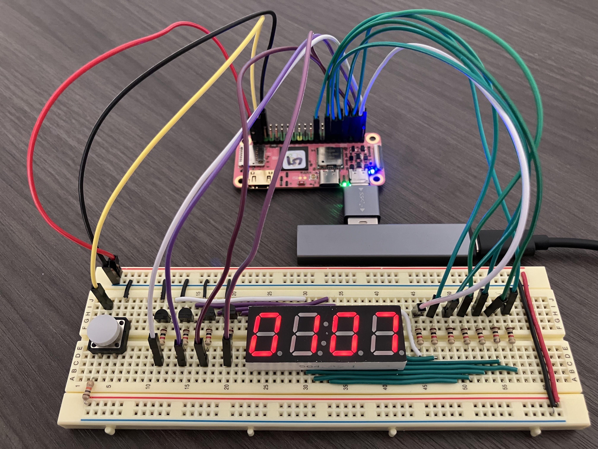
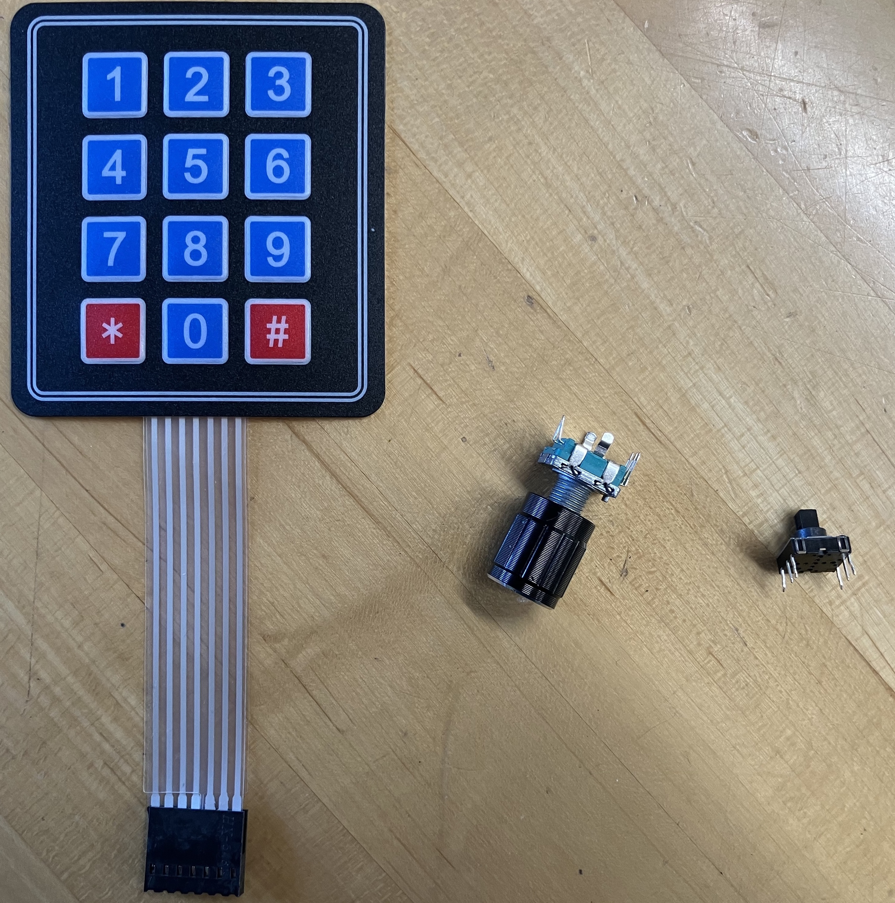
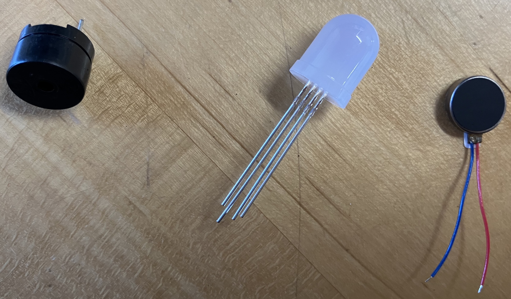


Task list to copy/paste when creating PR for this assignment:

__Before releasing assign2:__

- [ ] Review writeup/starter code (instructor)
- [ ] Review consistency/completeness of grading info published to students relative to grading tests used, consider changes clarity/ease of grading (TA)
- [ ] Followup on issues from previous quarter postmortem (issue #325)

__To prep for assign2:__

- [ ]





## Goals

Your next assignment is to build a clock using a 4-digit 7-segment
display.

The goals of this assignment are for you to:

- Get started with bare metal programming in C on the Mango Pi.
- Begin building a simple modular library of useful functions.
- Learn how to write and use automated test cases to validate your code's behavior.
- Learn how to access the RISC-V Control and Status Registers (CSR).
- Use your gpio and timer modules in the count down clock application.

## Get starter files

Change to your local `mycode` repo and pull in the assignment starter code:

```console
$ cd ~/cs107e_home/mycode
$ git checkout dev
$ git pull code-mirror assign2-starter
$ ls assign2
Makefile           cstart.c           memmap.ld          test_gpio_timer.c  timer_asm.s
clock.c            gpio.c             start.s            timer.c
```

In the `assign2` directory, you will find these files :

- Files you will edit:
    - `clock.c`:  your countdown clock application program
    - `gpio.c`, `timer.c`, `timer_asm.s`: implementation of the gpio and timer modules
    - `test_gpio_timer.c`:  test program with your unit tests for gpio and timer
    - `README.md`: edit this text file to communicate with us about your submission
- Files you will use as-is:
  + `Makefile`: rules to build clock application (`make run`) and unit test program (`make test`)
  + `cstart.c`, `start.s`, `memmap` are the support files needed for a bare metal C program.
  A bit later in the course, we will study these files to understand how they work and why they are necessary. Feel free to read over these files now to get a sneak preview, but don't worry if you don't fully understand them yet.

The `make run` target builds and runs the clock application
`clock.bin`. The `make test` target builds and run the test program
`test_gpio_timer.bin`, where you will add all of your unit tests. You will likely focus on using `make test` early in development. After you have completed and tested your library modules, then switch to using `make run` to work on your clock application.

## Modular design

The `gpio` and `timer` modules provide access to two of the Mango Pi peripherals. The `gpio` module has routines that control the GPIO pins and the `timer` module retrieves the system tick count. The two modules are specifically used by the application program in `clock.c`, but, more broadly, these modules are designed to be reusable in any future application that requires similar functionality. These two modules are the first of many more to come. By the end of the quarter, you will have implemented a complete set of modules that form a library of core functions for your Mango Pi.

Each module is divided into an _interface_ and its _implementation_. A module
interface is given in its header file e.g. `gpio.h` for the `gpio` module. In the header file, each public function is listed with its name, prototype, and documentation about what the function does. The implementation for the functions goes into the corresponding `gpio.c` file.

This idea of separating interface and implementation is fundamental to all software engineering: projects might have a different naming convention and file organization, but they always separate interface from implementation. Doing so abstracts away the implementation from a user, meaning that they can use the module without thinking about the underlying code that implements it. It also allows easily changing out the implementation -- this may become valuable towards the end of the course if you want to swap out your implementation for a reference one written by the staff.

For the `gpio` and `timer` modules, we specify the module interface; it is your job to write the module implementation to match the provided specification. The interface documentation in the header files is written for a client of the module. The client needs an overview of what functionality is exported by the module and information about how to use the functions and what behavior to expect from them. The interface does not describe any insider info of how the function gets its job done; those details are private to the implementation.

> __Where are the header files?__
> The module header files are stored in `$CS107E/include`. Change to that directory and list to see the filenames. Use `cat` to  view the contents of a file. You can also browse the [header files on this website](/header). Note you should should never edit/modify these header files, the interface is fixed and is not to be changed.
> {: .callout-info}

You will edit the source files `gpio.c` `timer.c` and `timer_asm.s` to complete the private implementation of the modules. You should not export additional public `gpio_` or `timer_` functions. However, you can add your own private helper functions by declaring those functions at the top of the C file with the `static` keyword to make them private and accessible only to the implementation.

The source file `clock.c` will contain the application program that operate the clock. The clock application does not directly access the peripherals, but instead calls on the public functions of your `gpio` and `timer` modules. There is no required interface for the clock application, but you should strive for a clean and well-decomposed program that would make your CS106 section leader proud.

From here on out, each assignment will be structured in the same way: you'll
implement a few library modules that an application program can leverage to accomplish some useful result.

## Testing

The CS106B assignments promoted testing in the [SimpleTest framework](https://web.stanford.edu/class/archive/cs/cs106b/cs106b.1242/resources/testing_guide.html); in CS107e, our poor man's version uses `assert`, but we share the same core values: write lots of unit tests and use a test-as-you-go strategy. Learning and practice effective strategies for testing will serve you well throughout your career as a programmer.

The `make run` target in the makefile is configured to build and run the clock application program. The alternate target `make test` will build and run the test program in `test_gpio_timer.c`. The first part of your work will be to implement the gpio and timer modules. To run tests against your modules, `make test` is the appropriate target to use. When working on the clock application, use the `make run` target.

The `test_gpio_timer.c` is a program whose purpose is to run unit tests.
The `main()` function makes a series of calls to `gpio` and `timer` functions and uses `assert()` in order to validate the operations work correctly.

Recall from Lab 2 how `assert()` drives the blue ACT LED on the Pi as a simple status indicator. If an assert fails, the program stops and blinks the ACT LED. If all asserts pass and the program finishes normally and the blue LED turns off to signal all is well.

The given `test_gpio_timer.c` only has a few very simple tests. You should
extend the test program with many additional tests of your own so that you thoroughly exercise the functionality of your modules. _Unit-testing_ each module in isolation before going on to integrate its use into an application is an important strategy for managing the development process as your programs become larger and more complex.

Learning how to effectively test your code is an important component of growing your programming skills, and we want to be sure to reward you for your testing efforts. The breadth and depth of the test cases you add to `test_gpio_timer.c` will be assessed as one of qualitative metrics for your submission. But don't think of this as merely an arbitrary requirement to please your grader! Your investment in constructing a comprehensive set of test cases means you can find (and fix) more bugs, resulting in a submission of higher quality.

## Core functionality

### 1. Implement and test gpio module
To build your Larson scanner, you controlled the gpios PB0-PB7 by writing assembly code that directly manipulated the `PB_CFG0` and `PB_DAT` device registers. Doing so in assembly is a neat accomplishment, but what would be even cooler is to have a set of handy C functions that you could call to control a GPIO by id and you would no longer have to drop down assembly or paw through the user manual to find each address. Writing a module of useful routines to control the GPIOs will be your first task of assignment 2.

[Section 9.7 of the D-1 User Manual](/readings/d1-h_user_manual_v1.0.pdf#page=1083)
contains the documentation for the GPIO peripheral on the Mango Pi. There are 88 multi-function GPIO pins that are organized into six groups (`PB`, `PC`, `PD`, `PE`, `PF`, `PG`). To control pin `PB0`, which is in the `PB` group, your code accesses the bits for pin index 0 within the `PB_CFG0` and `PB_DAT` registers. Note that each group has its own group-specific device registers, for `PC`, `PD`, and so on. To control the pin `PF3`, you access the bits for pin index 3 within the `PF_CFG0` and `PF_DAT` registers. The addresses of all gpio registers are listed in a [table on p.1080](/readings/d1-h_user_manual_v1.0.pdf#page=1093) of the user manual and a few pages further gives the division of bits within each register. As you implement the gpio module, you will abstract away those details inside the private implementation and provide the client with a simple, clean function to call `gpio_set_output(pin_id)` to set any valid gpio id to an output pin.

When implementing a module, start by reading the interface specification in its header file. Open `gpio.h` (available as `$CS107E/include/gpio.h` or [browse gpio.h here](/header#gpio). The header file declares the public functions and documents the expected behavior of each.

The eight functions exported by the `gpio` module are:

- `gpio_init`, `gpio_id_is_valid`, `gpio_set_input`, `gpio_set_output` (code pre-written)
- `gpio_set_function`
- `gpio_get_function`
- `gpio_read`
- `gpio_write`

Four of the functions are provided to you pre-written, along with a few helper functions.  Start by reviewing all of the provided code and comments in `gpio.c` and ask questions if there is anything unclear. Your task will be to complete the module by implementing the remaining four public functions.

We recommend that you start with by implementing `gpio_set_function`. This operation is used to configure a pin to a selected function. As you recall from assignment 1, you configure a pin by changing the appropriate bits in the associated `CFG` device register (e.g. `PB_CFG0` for pin PB0). Each group has its own separate `CFG` registers, i.e. `PB_CFG0` is distinct from `PC_CFG0`.  Within a group, each `CFG` register is associated with up to eight pins.  Pins with indexes 0-7 are configured in the `CFG0` register, pins 8-15 in the `CFG1` register and pins 16-23 in `CFG2` register. When updating the bits for a given pin, take care to not overwrite settings for the neighboring pins! This means you must first read the current state for all pins in this configure register, selectively modify the bits of interest, and write back the updated state.

Next write the companion function `gpio_get_function` that returns the function a pin has been configured for. You obtains the current setting for a pin by extracting its bits in the appropriate `CFG` register.

After implementing both set and get, you are ready to test your code. A simple first test case would be to configure a single pin using `gpio_set_function` and confirm that what is returned by `gpio_get_function` matches what was set. You will write test cases using the `assert` you learned about in lab2.

Open the test program `test_gpio_timer.c` in your editor and review the starter code version of `test_gpio_set_get_function()` to see a sample test case. Edit the `main()` and uncomment the call to `test_gpio_set_get_function()`. Use `make test` to build and execute the test program. If the blue LED on the Pi doesn't start flashing, the test program ran successfully -- bravo! If instead the Pi's blue LED is flashing, this means an assert failed.

If you passed the test, hooray! This is a good beginning, but the provided test is only a sample to get your started. You will need to add many test cases of your own to thoroughly exercise your code and confirm the full range of functionality. Here is a partial list of the expected features, each of these features corresponds to one or more test cases:

- get the pin function should match what was set
- can configure a pin to input, output, or alternate functions
  - refer to `gpio.h` header file for valid options
- a pin can be re-configured
  - e.g. set to output then set to input changes pin from output to input
- functions operate only on ids which are valid, reject requests that are not valid
  - there are 88 GPIO pins, spread across six groups (B-F)
  - a gpio id consists of a valid group and index (0-N depending on size of group)
  - the groups are differently sized, see the starter code for some help with identify the valid indexes for each group
- each pin's configuration is independent of others
  - access to a pin's configuration should not interfere with configuration of other pins

What other cases can you think of to add to the above? As you add each new test case, build and re-run your test program to verify success.

Your functions should also be robust against client error. If given an invalid pin or function, do not blunder on to sadness. The function documentation in the gpio.h header file gives specific guidance on the expected handling for improper calls. Once you have implemented that handling, add further test cases that confirm it is working as intended on such calls.

>__Pins with special function__ When writing test cases, take note that certain GPIO pins have specialized operation.
  - `GPIO_PD18` controls the blue ACT LED on the Mango Pi board. If you manipulate `GPIO_PD18`, expect the blue LED to be affected.
{: .callout-warning}

The `gpio_write` and `gpio_read` functions read and write the current pin state. To set a pin's state to high or low, write a 1 or 0 to the corresponding bit in the `DAT` register for the group. To read a pin's state, you read the corresponding bit from the group's  `DAT` register.

After implementing the functions, you are ready to test. The test program `test_gpio_timer.c` has a sample test in `test_gpio_read_write()` that calls `gpio_write` to change the state and confirms that `gpio_read` returns the update state. Consider what additional behaviors need to be confirmed and write test cases for each:

- read should match value that was written
- can read and write pins for any valid gpio id
- each pin's state is independent of others
- proper handling of invalid requests

Don't forget that observing the GPIO activity is another way to confirm correctness. An implementation of `gpio_write` and `gpio_read` that are both broken in same way could theoretically pass a round-trip unit test, but observing a blue LED or registering a button press is the real deal.

Having written your now-comprehensive test cases for the gpio module, you have completed your first module for your libmango library -- __Congratulations!__ 🏆

The `gpio` module is a key component of the library you are building. Several of the modules you will implement in later assignments will layer on `gpio`. Given your efforts to thoroughly test and vet the module, you will be able to confidently rely on it going forward!

>__A note on volatile__
Writing code that correctly interacts with a peripheral will require understanding of the `volatile` keyword. Below declares a pointer to the address for the memory-mapped device register holding the PB group data:
```
unsigned int *pb_data = (unsigned int *)0x02000040;
```
The contents at that address can, and should, be qualified as `volatile`:
```
volatile unsigned int *pb_data = (unsigned int *)0x02000040;
```
A `volatile unsigned int` indicates the value can change due to events not apparent in the code. `*pb_data` accesses the current pin state through the device register. Whether the state is 0 or 1 depends on what is physically connected to the pin, which can change externally. If C code repeatedly reads from `*pb_data` with no intervening write to the location, the optimizer could make the assumption that the value will not change and cache the value of the first read and re-use it later.
If type is qualified as `volatile`, the compiler cannot make that assumption and must re-read the value for each and every access.
Note that `volatile` is not something to throw about indiscriminately. Apply it thoughtfully and intentionally to those specific addresses that need to be treated in this special manner. Extraneous use of `volatile` can be misleading and will reduce performance as it disallows the compiler from making optimizations. Review the recommended readings on volatile from C Pointers lecture on the [Schedule page](/schedule#C_Pointers).
{: .callout-info}

### 2. Implement and test timer module

To implement the clock, we'll need to determine the passage of time. The RISC-V specification requires a machine counter `mtime` that tracks a tick count incremented with constant frequency (see documentation in [Section 3.1.10 of the Risc-V spec](/readings/riscv-privileged-20190608-1.pdf#page=44)).  On the Mango Pi, `mtime` is a 64-bit tick counter that is initialized to zero on reset and is continuously incremented at a rate of 24Mhz (i.e. each tick is 1/24 microsecond). This `mtime` register is not exposed as a memory-mapped address, instead access is provided using a `CSR` ("Control and Status Registers"). The CSRs are documented in [Section 2 of the Risc-V spec](/readings/riscv-privileged-20190608-1.pdf#page=17)). CSRs are accessed using special assembly instructions.  To read a CSR, the instruction is `csrr` (CSR read).  `csrr rd,which` will copy the value of CSR `which` into the destination register `rd`. CSRs can be identified either by name mnemonic or CSR number. In this case, either `time` or `0xC01` refers to the read-only CSR that mirrors the `mtime` machine register.

Read the header file `timer.h` to view the function declarations and documentation for the `timer` module. The module implementation is split over two files: `timer.c` for the C code and `timer_asm.s` for assembly code. You have only one task for the `timer` module which is to implement the function `timer_get_ticks` in `timer_asm.s` to access the current tick count. This function must be implemented in assembly, as CSR can only be accessed using special instructions.

After implementing the `timer_get_ticks` function, it's time to test. Uncomment the call `test_timer()` in `test_gpio_timer.c`. Use `make test` to build and run the test program. Verify the given tests succeed and then consider what additional tests are needed for the timer module (there may not be much; it is a pretty simple module). Once both the gpio and timer modules are passing all of your tests, you're ready to tackle the clock application.

### 3. Wire up and test clock hardware

Next turn your attention to the hardware for your clock display.

<A name="clock_spec"></a>

- Complete the breadboard circuit for the 4-digit 7-segment display you started in
  [Lab 2](/labs/lab2). Test your breadboard with jumper cables so that you know the
  wiring is correct before you connect it to the Mango Pi.
- In total, you will use 13 GPIOs on the Pi: seven to control the segments, four to control the digits, and one to read the state of the
   button. Here is the schematic from lab (click to enlarge):
  {: .zoom .w-75 }
  The assigned GPIOs appear to be random, but if you compare it to the [refcard](/guides/refcard), I think you'll see the method to our madness.
- The dots in the upper right of the schematic control the segments. Add male-to-female jumpers connecting the seven header pins for gpios `{PD17, PB6, PB12, PB11, PB10, PE17, PB0}` to the 1K current-limiting
  resistors on your breadboard that connect to segments A - G of the display unit. GPIO PD17 controls segment A, GPIO PB6 controls segment B, and so on.
- The dots in the lower left of the schematic are for the digits. Add male-to-female jumpers connecting the four header pins for gpios `{PB4, PB3, PB2, PC0}` to the 1K resistors at the base of the transistors controlling digits 1 through 4.
  GPIO PB4 controls the first digit, GPIO PB3 the second digit, and so on.
- Connect GPIO PG13 to read the state of the button. The button is
  connected to the power rail through a 10K pull-up resistor; pulling the default state high. Pressing the button grounds the circuit, bringing the reading low.
- Here's a photo of our clock breadboard connected to the Mango Pi.
  {: .zoom}

After wiring up your breadboard, you want to test all those connections and your shiny new gpio and timer modules are just what you need. In the `test_gpio_timer.c` there is a `test_breadboard` function. This test calls your gpio functions to configure the pins, and goes into a loop which flashes the segments one by one, exiting the loop when the button is pressed. Uncomment the call to `test_breadboard` and use `make test` to build and run the test program and visually confirm the operation of your display and fix any missed connections. Give yourself a pat on the back for your marvelous gpio module -- imagine how much harder it would be to manually test each of these connections!

Snap a photo of your finished hardware setup, copy the file to the `assign2` directory in your repo. Add and commit the file to include it with your submission. We want to see your beautiful handiwork!

### 4. Display a digit

You are now ready to start on the software for clock application.

In `clock.c`, create an array of 10 elements, one for each decimal digit. Each array element should
be a byte (8-bits). C has no `byte` type, but `unsigned char` suffices (there is also a `uint8_t` defined in `<stdint.h>` if you prefer it). The array entry at index 0 is the bit pattern for the digit 0, and so on for the digits 1 throgh 9.

Bit 0 (the least significant) will represent segment A, bit 1 segment B, and so on. If a bit is set, then that segment should be lit. For example, digit `0` consists of segments A-F, so its bit pattern is `0b00111111`. Digit `1` consists of just segments B and C, so its bit pattern is `0b00000110`. (`0b` is the prefix that introduces a binary number literal, just as `0x` prefixes a hexadecimal literal). Bit 7 (the most significant) could be used to represent `DP` but since we are not using the decimal point in this assignment, bit 7 will always be 0.

Write a function that displays a single digit and call it from the `main()` function of `clock.c`. Verify that your bit patterns are correct by displaying each digit value from `0` to `9` and visually confirming.
Use `make run` to build and run your clock application.

### 5. Write display refresh loop

The GPIO pins that drive the seven segments A to G are shared by
all four digits on the display. There is no way to turn on the display segments to show a `5` on the leftmost digit while simultaneously showing a `3` on the rightmost digit.

Instead of actually displaying a simultaneous `5` and `3`, you'll accomplish the same effect with a display refresh loop that iterates over the digits one-by-one in quick succession. It turns on the segments for the leftmost digit, waits a moment, and turns off those segments, then repeats the process for each of the other three digits. You might think that turning a digit on and off would cause it to flicker. The key is to sequence through the digits so fast that our eyes cannot see them changing. Good thing computers are fast!

Implement the display refresh loop in `clock.c`. Use the functions from
the `timer` module to control the wait time. Loop though all four digits, turning each on for 2500 microseconds. Do you see any flicker? How long does the delay have to for you to start to see it?

### 6. Implement countdown clock

The clock operates as a countdown clock. When the program is started, the display shows the countdown duration. The duration is expressed in minutes + seconds, e.g. "0230" is 2 minutes and 30 seconds. Your clock should work for any duration up to 99 minutes and 59 seconds. When you submit, please configure your clock for the default duration of 1 minute and 7 seconds (107!).

To start the countdown, the user clicks the button. The clock starts counting down by seconds, continually refreshing the display to show the remaining minutes and seconds. Confirm that the timer is calibrated correctly by observing that the clock is counting down at the right rate according to your watch or computer.

When the count reaches zero, play a little pattern on the display to announce the end of the countdown. This is your moment of creativity -- blinking/scrolling/snaking? Enjoy your victory lap!

This video shows countdown clock of 10-second duration:

<video controls="controls" width="400"
       name="Assignment 2 demo" src="images/clock_demo.mp4"></video>

__Mission accomplished!__  You have wired up a complex breadboard circuit, written two reusable
library modules and a clock application, as well as developing a testing methodology. Be sure to show off your spiffy new clock to your followers (but
not to the TSA next time you pass through airport security...).

## Troubleshooting

Here are some problems that have "bugged" students in the past, presented here to help you troubleshoot if your code isn't working:
- To express a number as binary constant, prefix it with "0b", e.g. 0b10110001.
- Make sure you declare the contents of peripheral registers as "volatile", otherwise the compiler might optimize away repeated reads/writes. If you don't understand why this is important, ask us in lecture, lab, or office hours -- it's important and also pretty cool!
- Make sure you connect to the correct header pins on the Mango Pi header! Use your refcard to identify which gpio is where.
- If you accidentally connect a full 3.3V to a segment LED or transistor base without the protection of a current-limiting resistor, it can fatally damage the component. If this fate befalls you, grab a replacement from the spare parts bin in the lab room or ask us for help in office hours.

## Extension: Putting the G in GPIO

The gpio and timer modules you have built can do so much more than turn on a led or read a button press. If you're eager to go further, consider this optional extension to explore additional input and output devices you can conect up to your GPIOs and further level up your clock. You'll add a new input device to set the countdown duration and a new output device for a fun alarm signal. We have a smattering of simple input and output devices that you can choose from. If you have access to a different device of your own that you want to try, come chat with us to see how it can work out.


### Input for setting the countdown duration
For your input device, we suggest choosing a rotary encoder knob, 5-way directional switch, or membrane keypad.  Each of these devices is composed of several buttons or button-like controls packaged together.

{: .zoom}

Design a user interface for your chosen input device that allows the user to to set the countdown duration. The duration can only be set before the countdown has been started. While the user is setting the duration, the display should change in some fashion to show it is in "set" mode; perhaps by flashing or scrolling a banner message on the display? Strive for an interface design that is easy to learn, straightforward to use, and provides clear feedback. It can be challenging to build an [interface with just a few buttons](images/dilbert160612.jpg). (Looking at you, [sign](images/bad_ui.jpg) found posted at the light switch in HCI wing of Gates building. Oh, the irony)

When reading from an input device, you will notice that a single press/turn action may cause the value on the GPIO pin to fluctuate several times.
This is due to characteristics of the physical mechanism causing the circuit to rapidly jitter between open and close multiple times before settling down. To address this
issue, you should implement __debouncing__ to discard those spurious events and process as a single event.
When you observe the value has changed, follow-up with additional reads to confirm that value has stabilized. Your goal is to strike a good balance where your interface feels responsive, yet processing is not so quick that it generates unwanted extra events.

A GPIO input typically needs a pull-up resistor to avoid being in an unreliable "float" state. You could do this
using hardware pull-up resistors, just as you did for the regular button, but if you read further into the GPIO chapter of the [D-1 user manual](/readings/d1-h_user_manual_v1.0.pdf#page=1090) you will discover that a Mango Pi GPIO has an internal pull-up resistor you can activate in software. Add a new function to your gpio module `activate_pullup` that activates the internal pull-up for a given gpio. Use your new function in place of hardware pull-up resistors for your input device.

### Output for alarm
For output devices, we have passive piezo buzzers, vibrating disc motors, or RGB LEDs. Simply turning on is not so thrilling, but using your timer and gpio modules to pulse these devices, i.e. turning on and off in specific patterns/timing, gives some cool effects!  Pulsing the buzzer at particular frequencies produces a square-wave tone; you can play a little melody or create sci fi sound effects. You can control the vibrating disc to provide haptic feedback in patterns like those used by your cell phone or watch. Pulsing the RGB LED gives you control over full color spectrum and brightness, enabling your own light show.

{: .zoom}

We have no rigid requirement for a specific fancy output for the extension -- we just ask you to do something you find creative and fun.

Here are some [notes/resources](extension) that could be helpful for the extension.

Before starting on the extension, be sure you have completed all core tasks, including commit, tag, and push of your completed code. This ensures your submit tag is a known good place that can be a fallback if the extension doesn't pan out.

The extension follows the same workflow, edit files on the `dev` branch, make regular commits and pushes. When you have successfully completed the extension, tag with `assign2-extension` so we know you to grade your extension.

Add documentation to the `README.md` file for `assign2` that shares what you learned from doing the extension and explains the input and output features of your fancy clock.  To grade the extension, we'll ask you to come by Kenny/Ben's OH and do a demo for us (since we won't have the hardware/board to match yours).


## Submitting

When submitting, your `assign2` directory should contain:

- a photo of your completed breadboard
- implementations of the `gpio.c` and `timer.c` modules
- comprehensive tests for both modules in `test_gpio_timer.c`
- application program `clock.c`
- `README.md` with any information you want to share with your grader, include info about the extension if you completed it

Submit your finished code by commit, tag `assign2-submit`, push to remote, and ensure you have an open pull request.
The steps to follow are given in the [git workflow guide](/guides/cs107e-git#assignment-submission).

## Grading

To grade this assignment, we will:

- Verify that your project builds correctly, with no warnings.
- Run automated tests on your `gpio` and `timer` modules.
- Observe your countdown clock running on a Mango Pi wired to a clock breadboard
  and visually confirm its operation. Our hardware setup will be configured exactly as specified in the [schematic](#clock_spec).
- Admire the photo you submit of your completed breadboard.
- Go over the unit tests you added to `test_gpio_timer.c` and evaluate them for
  thoughtfulness and completeness in coverage.
- Review your code and provide feedback on your design and style choices.

Our highest priority tests will focus on the core features for this assignment:

- Essential functionality of your library modules
  - Set/get the function on any valid pin
  - Read/write to any pin
  - Reading the timer value, timed delay
- Clock application
  - Countdown clock works correctly

The additional tests of lower priority will examine less critical features, edge cases, and robustness. Make sure you thoroughly tested your for a variety of scenarios!

__Note: Build warnings/errors__ We expect your code to compile cleanly with no warnings or errors. Warnings are the way the compiler draws attention to a code passage that isn't an outright error but appears suspect. Some warnings are mild/harmless, but others are critically important. If you get in the habit of keeping your code compiling cleanly, you'll never miss a crucial message in a sea of warnings you are casually ignoring. The provided makefile is set to treat warnings as errors, and your code will be graded in the same way.

### Our grading process

- We run automated grading tests against the submissions and CAs do a qualitative review of your code and tests. We give feedback on your pull request and use __GitHub issues__ to report tests that were not passed.
- Our automated grading tests are organized by __priority__.  Higher priority tests are considered more significant in grading.
  + __P1 "Essential"__ tests exercise core functionality that is critical to the system's operation. Your system won't be fully usable until these high priority issues are addressed.
  + __P2 "Comprehensive"__ tests thoroughly exercise the full range of functionality including lesser-traveled features.
  + __P3 "Just Mention__" is used for small concerns as a misbehavior in an obscure edge case or minor issue of polish.
- We have a __revise and retest__ policy for library modules. We will file GitHub issues for any test failure that is eligible for revision, and you may submit bug fixes for retest. Commit and push changes to your repo on your `dev` branch and tag the finished commit with `assign2-retest` (Do __not__ move the original `assign2-submit` tag!)  Once a week, the staff will re-run the automated tests on submissions tagged `assign2-retest` and update to show passing results on corrected issues.
- We accept revisions for priority 1, 2, and 3 automated tests on your library modules. There is no retest/resubmit for extensions or tests that are manually evaluated (all of A1 and the clock tests for A2). Such tests are run only against your original submission, marked with the `assign2-submit` tag.

By the end of the quarter, we want your library modules to have passing results on all Priority 1 tests. Lower priority tests and tests on non-library modules can be fixed at your discretion, but are also taken into consideration when determining final grades.

## Good habits == good results

We encourage you to consciously develop habits that will serve you well in this course and going forward. Here are a few we recommend you start today:

- Practice with your tools and work to establish comfort with your environment. Be alert to where you have rough spots in your workflow,and make an effort to smooth it out. This might take the form of learning additional editor features, becoming more facile with the command-line, or customizing your environment more to your needs. Share your tips on Ed and ask for advice from others!
- Make __frequent git commits__ to record a snapshot of your ongoing work. This gives you an audit trail of your progress in your local repo and each commit is a place to compare or return to should anything go astray. When at a clean stopping point, use __git push__ to sync your local history to your GitHub remote repo. You can think of your remote repo as your "off-site" backup that ensure that all of your hard work is safely recorded.
- When writing unit tests, do not comment out tests to de-activate them once you have confirmed they are passing. If you __keep previous tests active__ so that they execute on every future run of the test program, this alerts you if you accidentally introduce a regression, i.e. a change causes a previously passing test to now fail.
