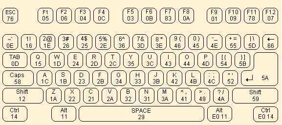


Task list to copy/paste when creating PR for this assign:

__Before releasing assign5:__
- [ ] Review writeup/starter code (instructor)
- [ ] Review consistency/completeness of grading info published to students relative to grading tests used, consider changes clarity/ease of grading (TA)
- [ ] Followup on issues from previous quarter postmortem (issue #338)

__To prep for assign5:__
- [ ] 




> __Heads up!__ Tuesday Nov 5th is [Democracy Day](https://www.democracydaystanford.org/)! The deadline for on-time submissions for Assign 5 is pushed back to __Wed Oct 6__. The grace period is not changed and ends __5pm Thu Oct 7__.
{: .callout-info}


<style>
.mango-shell {
    font-size: 80%;
    font-weight: 600;
    margin: 10px;
    background-color: #EFC668;
}
</style>

<pre class="mango-shell">
Welcome to the CS107E shell.
Remember to type on your PS/2 keyboard!
Pi> help
   help [cmd]               print command usage and description
   echo [args]              print arguments
   reboot                   reboot the Mango Pi
   clear                    clear screen (if your terminal supports it)
   peek [addr]              print contents of memory at address
   poke [addr] [val]        store value into memory at address
Pi> help reboot
   reboot                   reboot the Mango Pi
Pi> echo cs107e rocks my sox
cs107e rocks my sox 
Pi> echo I can use poke to turn on and off the blue LED!
I can use poke to turn on and off the blue LED!
Pi> poke 0x20000a0 0x40000
Pi> poke 0x20000a0 0
</pre>

## Goals

For this week’s assignment, you will implement a PS/2 keyboard driver and
implement a simple command-line shell. You will then be able to type commands
and execute them on your Pi. Neat!

In completing this assignment you will have:

- written code that interfaces with an input device. When you next download a
  device driver, you will think "I have a decent idea how that code operates",
- seen the design of a complex interface into hierarchical levels and
  appreciated its benefits,
- implemented a simple command-line interpreter, and
- explored the use of C function pointers for callbacks and command dispatch.

This is a fun assignment, and brings us back to using physical devices and
making them do cool things. These additions are the first steps toward turning
your humble little Mango Pi into a standalone personal computer.

## Get starter files
Change to your local `mycode` repo and pull in the assignment starter code:

```console
$ cd ~/cs107e_home/mycode
$ git checkout dev
$ git pull code-mirror assign5-starter
```

In the `assign5` directory, you will find these files:
- `ps2.c`, `keyboard.c`, `shell.c`:  library modules 
- `test_keyboard_shell.c`:  test program with your unit tests
- `uart_shell.c`:  application program that runs your shell, reading input from the PS/2 keyboard and printing output to the uart. You will use this program unchanged.
- `Makefile`: rules to build uart_shell application (`make run`) and unit test program (`make test`)
- `README.md`: edit this text file to communicate with us about your submission

The `make run` target builds and runs the sample application
`uart_shell.bin`. You can use this target to test the full integration of
your ps2, keyboard, and shell modules.  The `make test` target builds and run
the test program `test_keyboard_shell.bin`. This test program is where
you will add all of your unit tests. You will make heavy use of this target
throughout your development. Assign 5 has no `make debug` target because the gdb simulator
does not emulate peripherals; no gpio and timer means no keyboard driver.

You can edit `MY_MODULE_SOURCES` in the `Makefile` to choose which modules of yours to build on. (See instructions for [use of MY_MODULE_SOURCES](/assignments/assign3/#mymodules) in assignment 3.)


## Core functionality

### PS/2 Keyboard driver

#### 1) Review interface (ps2.h and keyboard.h)
The PS/2 keyboard driver is divided over the two modules `ps2` and `keyboard`.
Start by reviewing the header files (available in `$CS107E/include` or [browse
here](/header)). The functions of the `ps2` module are:

+ `ps2_device_t *ps2_new(gpio_id_t clock_gpio, gpio_id_t data_gpio)`
+ `uint8_t ps2_read(ps2_device_t *dev)`

And `keyboard` functions:

+ `void keyboard_init(gpio_id_t clock_gpio, gpio_id_t data_gpio)`
+ `char keyboard_read_next(void)`
+ `key_event_t keyboard_read_event(void)`
+ `key_action_t keyboard_read_sequence(void)`
+ `uint8_t keyboard_read_scancode(void)`

The design of the keyboard driver is worth a pause to understand and
appreciate. All of the nitty-gritty low-level protocol details are encapsulated
within the `ps2` module. The `keyboard` module layers on that to implement the
logic to process scancodes into sequences, events, and typed characters. Within
the keyboard module, the functionality is arranged hierarchically, each routine
building on the next. The bottom level routine reads a raw scancode (by
delegating to the `ps2` module), the next level gathers a sequence of scancodes
into one logical key action, the higher level routines translate those actions
into key events and typed characters.

The layered interface cleanly supports the needs of different clients. A client
that simply wants typed characters might use only the top level
`keyboard_read_next`; a client that reacts to key up and down events would instead access
the mid level `keyboard_read_event`.  

The hierarchical design also eases the job of the implementer. Each level
focuses on a discrete part of the operation and delegates tasks above and below
to other functions. This makes each function simpler to implement and test.
Your implementation plan of attack is to start at the bottom and work your way
upward.

#### 2) Read and validate scancodes (ps2 module)
The `ps2` module encapsulates functionality for interacting with a PS/2 device.
Read over the [ps2.h header file](/header#ps2). The `ps2.c` module has only two functions: `ps2_new` and `ps2_read`.

Review the given code for the `ps2_new` function in the `ps.c` file. Take care to understand how it
initializes the device and configures the gpio pins.
The `struct ps2_device` tracks the state
associated with a single PS/2 device. The struct as defined in the starter code has
just two fields (ids for the clock and data gpios). If you later encounter a need to track
additional state, simply add more fields to the struct definition and initialize those fields in `ps2_new`.

In lab 5, you got a start on implementing `ps2_read`  function. Copy that work
into `ps2.c` now. The entire PS/2 protocol rests on this cornerstone, so your
first task is to finish it off and ensure it is reliable and robust.

A PS/2 scancode is an 11-bit packet organized in 8-odd-1 format. The first bit,
the start bit, is low. The next 8 bits are data bits, least significant bit
first. The following bit is a parity bit. The PS/2 protocol uses odd parity,
which means that there should be an odd count of on bits in the data and parity
bits. The 11th and final bit is the stop bit, which is always high.
The return value from `ps2_read` is the 8 data bits.


> **Timing is everything!** The timing of the PS/2 protocol has to be strictly
> followed. The keyboard sends the bits of the scancode one after another in
> tight sequence and your driver has to observe each bit
> as it arrives. Once your driver sees the falling clock edge for the start
> bit, it needs to stay on task to read each subsequent bit.  There is not time
> between clock edges to complete a call to a complex function like `printf`.
> Save any debug printing for after you read the entire sequence.
{: .callout-warning}

The `ps2_read` function reads one well-formed scancode.
"Well-formed" means that the start, parity, and stop bit each have valid values.
If `ps2_read` encounters an invalid bit, it should abandon
the partial scancode and retry, reading the next bit as the start of a new scancode. Discard as many invalid attempts as necessary, only returning when a full valid scancode is received. A scancode is represented using the type `uint8_t`, e.g. 8-bit `unsigned int`.

The first test in `test_keyboard_shell.c` will read and echo scancodes as read by the keyboard. Use
this test to verify this basic part of your keyboard driver.

#### 3) Gather sequence into key action (keyboard_read_sequence)

The next level function `keyboard_read_sequence` in `keyboard.c` gathers a sequence of
scancodes into one logical key action.  A key action is the press or release of
a single key.

When you press a key, the PS/2 keyboard sends the scancode for that key. When
you release the key, it sends a two-byte sequence: `0xF0` (the "break" code)
followed by the key's scancode. For example, typing `z` will cause the keyboard
to send `0x1A` and releasing `z` will cause the keyboard to send `0xF0`,
`0x1A`.

The press or release of an extended key sends a sequence with the extra byte
`0xE0` inserted at the front. For example, pressing the right Control key sends
the sequence `0xE0`, `0x14` and releasing sends `0xE0`, `0xF0`, `0x14`.

Review [keyboard.h](/header#keyboard) for the description of the function `keyboard_read_sequence` and the definition of the type `key_action_t`. Implement the function to read the sequence (1, 2 or 3 scancodes
depending on context) and translate it into a `key_action_t` struct which
reports the type of action and which key was involved.

Use the test in `test_keyboard_shell.c` that reads sequences to verify the
operation of this function before moving on.

#### 4) Process key events (keyboard_read_event)

The mid level routine `keyboard_read_event` processes key actions into key
events. It calls `keyboard_read_sequence` to get a `key_action_t` and packages
the action into a `key_event_t` struct which includes the state of keyboard
modifiers and the PS/2 key that was acted upon.

There are some additional types and constants used by this function. Review [keyboard.h](/header#keyboard) for the definitions of `keyboard_modifiers_t` and `key_event_t` and [ps2_keys.h](/header#ps2_keys) for
the definition of `ps2_key_t` and keycode constants.

The `modifiers` field of a `key_event_t` reports which modifier keys are in
effect.  The state of all modifier keys is compactly represented using a _bit
set_. The `keyboard_modifiers_t` enumeration type designates a particular bit
for each modifier key.  If a certain bit is set in `modifiers`, this indicates the
corresponding modifier key is currently held down or in the active state. If
the bit is clear, it indicates the modifier is inactive. 

The PS/2 protocol does not provide a way to ask the keyboard which modifiers
are active, instead your driver must track the modifier state itself. A simple
approach is a module-level static variable in your keyboard module that you update in
response to modifier key actions. The Shift, Control, and Alt modifiers are
active if and only if the corresponding modifier key is currently held down.
Caps Lock operates differently in that its setting is "sticky". A press of the
Caps Lock key makes the modifier active and that state persists even after
releasing the key. A subsequent press of Caps Lock inverts the state of the modifier.

To associate each key with the characters it can produce, we provide an
array to use as a _lookup table_. Review the definition of the `ps2_keys` array
in the source file `$CS107E/src/ps2_keys.c` ( [ps2_keys.c](/src#ps2_keys)) The array is indexed by scancode.
The array element at each index is a struct. For example, the __A__ key
generates scancode `0x1C`. The array element `ps2_keys[0x1c]` holds the struct
`{'a', 'A'}` which is the unmodified and modified character produced by this
key.

Review [keyboard.h](/header#keyboard) for the description of the function `keyboard_read_event`. Implement the function as described. Use the functions in `test_keyboard_shell.c` to verify your processing of key
events before moving on.

#### 5)  Produce ASCII characters (keyboard_read_next)

You now have all of the pieces needed to implement the final top-level routine
`keyboard_read_next`.  This function calls `keyboard_read_event` to get the
next key press event and produces the character corresponding to the key that
was typed. 

The return value is the ASCII character produced by an ordinary key or a  value
designated for a special key such as Escape or F9. The character produced by a
key is determined by its `ps2_key_t `entry in the lookup table.

A `ps2_key_t` has two fields for each key, `ch` and `other_ch`, which
correspond to the unmodified and modified character produced by the key.  The
__A__ key produces `{ 'a', 'A' }`. The __Four__ key produces `{ '4', '$' }`.
Keys such as __Tab__ that are unchanged by the modifier have the same character
for `ch` and `other_ch`, e.g. `{'\t', '\t'}`.

The keyboard diagram below shows which keys your keyboard driver is required to handle. Keys not shown in this diagram, e.g. numeric keypad, arrow keys, home, scroll lock, etc., are __not required__.

{: .zoom .w-75}

Typing an ordinary key produces an ASCII character. The ordinary keys are:
- All letters, digits, and punctuation keys
- Whitespace keys (Space, Tab, Return) 
- Backspace (Delete,←,⌫) produces `'\b'` (ASCII backspace)

Typing a special key produces its designated value. These values are greater
than 0x90 to distinguish from ASCII values. The special keys are:
- Escape
- Function keys F1-F12

Press or release of a modifier key changes the event modifiers.  No character
or code is produced.  The modifier keys are:
- Shift, Caps Lock, Alt, Control

A change in modifiers can affect the character produced by future typed keys.
The keyboard translation layer does not produce modified characters based on
state of Alt or Control, only for Shift and Caps Lock. When the Shift modifier
is active, `other_ch` is produced when typing a key that has an `other_ch`
entry. If Caps Lock is active, `other_ch` is produced only for the alphabetic
keys. Caps Lock has no effect on digits, punctuation, and other keys. If Shift
and Caps Lock applied together, Shift "wins", e.g. `other_ch` is produced.
(Caps Lock and Shift together do not invert letters to lowercase). 

If you are using a Mac, Keyboard Viewer is a handy tool for visualizing the
character produced for a given key combination. Try it out!  If you are still
unsure how to handle a particular case, experiment with our reference
implementation of the keyboard using the test application from lab.

Review [keyboard.h](/header#keyboard) for the description of the function `keyboard_read_next`. Implement the function as described. Use the functions in `test_keyboard_shell.c` to test.

Congratulations, you have completed your keyboard driver!

### Simple shell
With a keyboard as input device, your Pi has gone interactive. The simple shell
application allows the user to enter commands and control the Pi without
needing to work through another computer.

The video below demonstrates of our reference shell. The user is typing
on a PS/2 keyboard connected to the Pi and the shell output is displaying over
uart to a Mac laptop running tio.

<video controls="controls" width="500"
       name="Assignment 5 demo" src="images/mango_shell.mp4"></video>

#### 1) Review shell interface and starter code

A shell, such as `bash` or `zsh`, is a program that operates as a command-line
interpreter. The program sits in a loop, reading a command typed by the user
and then executing it. 

The starter code for `shell_run` demonstrates the standard read-eval-print loop
that is at the heart of an interpreter. Here it is in pseudocode:

    loop forever
        display prompt
        read line of input from user
        evaluate command (parse and execute)

The public functions you will implement in shell are:

+ `void shell_readline(char buf[], size_t bufsize)`
+ `int shell_evaluate(const char *line)`

The `shell_readline` function reads a command typed by the user. The
`shell_evaluate` executes that command.  Review the documentation for these
operations in the header file [shell.h](/header#shell).
 
The client can configure the input and output for the shell. The `shell_init`
function takes two _function pointer_ arguments to be supplied by the client,
one for input and one for output.  Whenever the shell wants to read the next
character entered by the user, it calls the client's input function. When it
needs to display output, it calls the client's output function.

The `apps/uart_shell.c` application program initializes the shell with
`shell_init(keyboard_read_next, printf)`; this call configures the shell to
read characters from the PS/2 keyboard and send output to the serial uart
interface. 

The shell stores the client's function pointers into the static variable `module`.
The input function is stored `module.shell_read` and the output function into `module.shell_printf`.
Thereafter the shell calls `module.shell_read` whenever it needs to read input from
the user and calls `module.shell_printf` whenever it needs to write output.  This
applies to all shell output, whether it be the shell prompt, displaying the
result from a command, or responding with an error message to an invalid
request. 

When testing your shell in assignment 5, you will likely always use
`keyboard_read_next` as the input function and `printf` as the output, but the
flexibility you are building in now lays the groundwork for different choices
in the future. In assignment 6, you'll write the function `console_printf` that
draws to a HDMI monitor. With a change of one argument in the call  to
`shell_init(keyboard_read_next, console_printf)` your shell will display output
on the graphical console instead of writing to the uart — nifty!

#### 2)  Read line

`shell_readline` calls `module.shell_read` to read a character entered by the user and gathers the line of input into a buffer. The user indicates the end of the line by typing Return (`\n`). `shell_readline` only gathers valid characters in the buffer, e.g. ASCII characters `ch <= 0x7f`.  The shell discard keys typed by the user that do not produce an ASCII character (function keys, escape).

Handling backspace adds a wrinkle. When the user types Backspace (`\b`),
the shell should delete the last character typed on the current line.  Removing it
from the buffer is simple enough, but how to un-display it? If you output a
backspace character, e.g. `module.shell_printf("%c", '\b')` , it moves the cursor
backwards one position. If you back up, output a space, and then back up again,
you will have effectively "erased" a character. (Wacky, but it works!) 

There are two error conditions that `shell_readline` should detect:
- disallow typing more characters than fit in the buffer
- disallow backspacing through the shell prompt or to previous line

Reject the attempt and call the provided `shell_bell` function to get an audio/visual beep.

`shell_readline` is a great way to exercise your shiny new keyboard driver!

#### 3) Parse command line

`shell_evaluate` first takes the line entered by the user and parses it into a
command and arguments. The parsing job is all about string manipulation, which
is right up your alley after assign 3.

+ Divide the line into an array of tokens. A token consists of a sequence of
  non-space chars.  
+ Ignore/skip all whitespace in between tokens as well as leading and trailing
  whitespace. Whitespace includes space, tab, and newline.
+ The first token is the name of the command to execute, the subsequent tokens
  are the arguments to the command.

When tokenizing, be sure to take advantage of the functions you
implemented in your `strings` and `malloc` modules. They will be helpful!  Also,
code presented in lecture or lab is always fair game for re-purposing (cough, exercise 2
of lab 4, hint, ...).

#### 4)  Execute command
Now that you have the command name and arguments, you're ready to evaluate it.

+ Look up the function pointer for the command by name. The command table associates a command name string with its function pointer.
    + If no matching command is found, output message `error: no such command 'binky'.` and return a nonzero result.
+ Call the function pointer, passing the array of tokens and the count of tokens. The first element in the array is the command name, the subsequent elements are the arguments to the command.
+ The return value of the command is used as the return value for `shell_evaluate`.

There is a command table started in `shell.c`. You will modify the table as you add commands. Each entry in the table is a `command_t` struct. A command function pointer takes two parameters: `argv` is an array of `char *`, i.e. an array of strings, and `argc` is the count of elements in the  `argv` array. A command function returns an int to indicate success or failure. The result is 0 if the command executed successfully, or nonzero otherwise.

Your shell has five commands:

- `int cmd_echo (int argc, const char *argv[])`
- `int cmd_help (int argc, const char *argv[])`
- `int cmd_reboot (int argc, const char *argv[])`
- `int cmd_clear (int argc, const char *argv[])`
- `int cmd_peek (int argc, const char *argv[])`
- `int cmd_poke (int argc, const char *argv[])`

Be sure to carefully review the documentation in [shell_commands.h](/header#shell_commands). This header
file gives example use of each command, including the required error handling and expected output.

The starter code provides a working implementation of `cmd_echo` and `cmd_clear` as examples. The `echo` command simply prints its arguments:

```console?prompt=Pi>
Pi> echo Hello, world!
Hello, world!
```

The `clear` command sends a formfeed `\f` character to your terminal. For terminal programs such as `tio` that support formfeed, this will scroll up the existing output to clear the screen. (If your terminal doesn't support formfeed, `clear` will act as a no-op. You do not need to try to fix this.)

The additional commands you are to implement are:

+ **help**

    With no arguments, `help` prints the usage and description for all available commands:

    ```console?prompt=Pi>
Pi> help
help [cmd]               print command usage and description
echo [args]              print arguments
...
    ```
    If an argument is given, `help` prints the usage and description for that command,
    or an error message if the command doesn't exist:

    ```console?prompt=Pi>
Pi> help reboot
reboot    reboot the Mango Pi
Pi> help please
error: no such command 'please'
    ```

    (Side note: The reference shell makes the help usage and description line up in neat columns by adding extra spaces in the string constants. This is not required, just something we did because we are fussy. The output comparison we use in grading ignores whitespace, so no worries if your spacing is different. )

+ **reboot**

    The `reboot` command resets your Pi. It calls the `mango_reboot` function from the `mango` module of `libmango` to do a software reset. See ya back at the bootloader!

+ **peek**

    The `peek` command prints the 4-byte value stored at memory address `addr` as an unsigned hex value in format `%8x`.

    Below we use `peek` to read  address `0x40000000`, the memory location of the start of the text section. The first instruction of `_start` is encoded as `30047073`.

    ```console?prompt=Pi>
Pi> peek 0x40000000
0x40000000:   30047073
    ```
   Hint: the `strtonum` function from your strings module will be handy for converting strings to numbers. If the address argument is missing or cannot be converted, `peek` prints an error message:

    ```console?prompt=Pi>
Pi> peek
error: peek expects 1 argument [addr]
Pi> peek bob
error: peek cannot convert 'bob'
    ```

    A 4-byte value should only be read on address aligned to a 4-byte boundary (i.e. multiple of 4). If the user asks to peek (or poke) at an unaligned address, respond with an error message:

    ```console?prompt=Pi>
Pi> peek 7
error: peek address must be 4-byte aligned
    ```

    To test `peek`, try a location of an encoded instruction in the text section or a global variable in the data section. Use `riscv64-unknown-elf-nm uart_shell.elf` to get symbol addresses. You can also use the location for gpio `CFG` or `DATA` registers to read values of a peripheral register.

+ **poke**

    The `poke` command stores `val` into the memory at location `addr`.

    Below is an example using `poke` to write at address `0x40000000`. (This memory location stores the first instruction of your program. Since that code has already executed and will not be re-entered, we can overwrite it without causing problems for the executing program):

    ```console?prompt=Pi>
Pi> peek 0x40000000
0x40000000:   30047073
Pi> poke 0x40000000 1
Pi> peek 0x40000000
0x40000000:  00000001
Pi> poke 0x40000000 0xffffffff
Pi> peek 0x40000000
0x40000000:  ffffffff
    ```
    If an argument is missing or invalid, `poke` prints an error message:

    ```console?prompt=Pi>
Pi> poke 0x40000000
error: poke expects 2 arguments [addr] and [val]
Pi> poke 0x40000000 wilma
error: poke cannot convert 'wilma'
    ```

    You can now control a GPIO pin via peek and poke commands in your shell!

    ```console?prompt=Pi>
Pi> poke 0x2000098 0x100
Pi> poke 0x20000a0 0x40000
Pi> poke 0x20000a0 0
    ```

  __Tread carefully when testing peek and poke__.  The peek and poke commands operate on live memory. The only error detection is to reject an address that is not a well-formed number or is not 4-byte aligned.  If the address supplied by the user passes the simple validity check, the command will attempt to read/write that memory location.  Reasonable addresses to test on are those within the range of the Mango Pi DRAM (`0x40000000` - `0x5fffffff`) and addresses of memory-mapped peripherals such as gpio and uart. A test that accesses an address outside the known memory map can behave unpredictably. Indiscriminate use of `poke` can be deadly as you are changing values in memory out from under the executing program.  Before you test `poke` an address, be sure you know what is stored there and what effect your change will have. Once you have tested `peek` and `poke` on a few carefully selected addresses, it is reasonable to extrapolate that it will also handle other valid locations without testing on every single address in the entire address space. 😅

    Check out the
    [Wikipedia article on peek and poke](https://en.wikipedia.org/wiki/PEEK_and_POKE) if you're curious to learn about their historical origins.

> __Shell output__
    When writing a shell command, be sure that all output is made through `module.shell_printf` and
    aim for your output to __exactly match__ the format and wording of the output and 
    error messages given above.  We know this request is nitpicky, but this enables automated 
    comparison of shell output which translates to fewer staff hours going into manual grading 
    and more time to hang out with y'all in office hours.  Your graders thank you in advance!
{: .callout-success}

## Testing and debugging
As usual, the effort you put into writing good tests will be evaluated along
with your code submission. An interactive program such as this one adds new
challenges for testing. Your inventive solutions to overcoming these challenges
are welcome!

The given code in `test_keyboard_shell.c` program has functions that test each
layer of the keyboard module. These functions simply echo the data returned by
the keyboard module. You must manually verify the correctness of the output. 

The `test_keyboard_assert` function demonstrates an example approach for an
assert-based test where you coordinate with the user to provide the keyboard
input.

The `shell` module is intended to be run interactively and does not lend itself
well to assert-based testing. This doesn't mean you should eschew testing it,
but you will have to be more creative in how you proceed. It may help to
testing `shell_evaluate` separately from `shell_readline`. Try calling
`shell_evaluate` on a fixed command and manually observe that the output is as
expected. 

The function `shell_readline` can get messy if trying to test your shell and
keyboard at same time. There is some sample code in `test_keyboard_shell.c`
that demonstrates a testing function that returns the next character from a
fixed sequence. This function can be used as input function for the shell in
place of `keyboard_read_next` as a way to test `shell_readline` independent of
your keyboard driver.

## Extension: shell++

If you are eager to go further, the extension is to implement all of these three additional shell features: __(1)__ command-line editing, __(2)__ command history, and __(3)__ your choice of bonus command/feature.

1.  **Command-line editing**

    Implement the left and right arrow keys to move the cursor within the current line and allow inserting and deleting characters at the point of the cursor. What other editing features might be nice to have:  `Ctrl-a` and `Ctrl-e` to move the cursor to the first and last character of the line? `Ctrl-u` to delete the entire line? Implement your favorite vim/emacs/editor must-haves!

2. **Command history**

    Number the commands entered starting from 1 and maintain a rolling history of the last 10 commands entered. Change the prompt to include the command number of the current line. Add a `history` command that displays the history of recent commands, each prefixed with its command number. See the example below:

    ```console?prompt=Pi>
[1] Pi> help echo
echo    print arguments
[2] Pi> echo cs107e rocks
cs107e rocks
[3] Pi> history
  1 help echo
  2 echo cs107e rocks
  3 history
    ```

    Implement the up and down arrow keys to access commands from the history. Typing an up arrow changes the current line to display the command from the history that is previous to the one on the current line. Typing a down arrow changes the current line to display the command that ran _after_ the one on the current line, or whatever the user had typed until he/she typed up. Use the `shell_beep` when the user tries to move beyond either end of the history.

    What other history features will be handy? `!!` to repeat the last command? `!po` to repeat the most recent command matching the specified prefix `po`?

    If you didn't already know that your regular shell includes editing and history features like these, now is a great time to pick up a few new tricks to help boost your productivity!

3. **Bonus command/feature**

    The final extension task is to implement a bonus command/feature of your own design that supercharges your shell to your liking.  Need to spare your overworked fingers? Add `tab` to auto-complete command names or environment variables that remember state. What shell commands/features would make your shell feel uniquely yours? Our reference shell includes add-ons for `gpio` (control gpio pins), `calc` (simple calculator), `hexdump` (extended peek), `pinout` (display header pinout), `backtrace` (current backtrace), `nm` (print symbol table), and `disassemble` (using the assign3 disassemble extension). We do not have one specific bonus command/feature for everyone to implement; we welcome you to add anything that you would learn something valuable from implementing and/or would appreciate having in your shell.

To submit the completed extension for grading, tag with `assign5-extension`. In your `assign5/README.md`, tells us about all of the editing, history, and bonus features supported by your fancy extended shell so we'll know how to try it out when grading.

## Submitting

The deliverables for `assign5-submit` are:

+ implementations of the `ps2.c` `keyboard.c` and `shell.c` library modules
- comprehensive tests for all modules in `test_keyboard_shell.c`
- `README.md` (possibly empty)

Submit your finished code by commit, tag `assign5-submit`, push to remote, and ensure you have an open pull request. The steps to follow are given in the [git workflow guide](/guides/cs107e-git#assignment-submission).


## Grading

To grade this assignment, we will:

- Verify that your submission builds correctly, with no warnings. Clean build always!
- Run automated tests on your `ps2`, `keyboard` and `shell` modules
    +  __Take care!__ Our automated testing requires that your shell has absolute consistency in calling `module.shell_printf` for all shell output. Double-check that you are compliant. Be sure to remove or comment out all use of `printf` and debugging output.
- Go over the test cases you added to `test_keyboard_shell.c` and evaluate for thoughtfulness and completeness in coverage.
- Review your code and provide feedback on your design and style choices.

Our highest priority tests will focus on the core features for this assignment:

- Essential functionality of your library modules
  - ps2
    - read well-formed scancode
    - discard malformed (wrong start/stop/parity) and restart
  - keyboard
    - read events from all keys
    - handling of modifiers, including caps lock
  - shell
    - user-entered input
    - parse and execute command
    - handling of backspace
        - __we will not test__: backspace through tab character (tab is converted behind your back to variable number of spaces by your terminal program, you don't need to account for this)

The additional tests of lower priority will examine less critical features, edge cases, and robustness. Make sure you thoroughly tested for a variety of scenarios!


