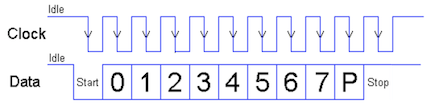


Task list to copy/paste when creating PR for this assign:

__Before releasing assign7:__
- [ ] Review writeup/starter code (instructor)
- [ ] Review consistency/completeness of grading info published to students relative to grading tests used, consider changes clarity/ease of grading (TA)
- [ ] Followup on issues from previous quarter postmortem (issue #409)

__To prep for assign7:__
- [ ] 



{: width="50%" style="float:right;"}


---
## Goals

With all your hard work on the previous assignments, your Mango Pi
can now read input from a keyboard and respond to your commands by drawing to a
graphical console display. For the _pièce de résistance_ you'll upgrade
your keyboard driver so that you can type as fast as the wind without
dropping characters.

Conceptually, this is about concurrency and preemption. Concurrency
is when a program is able to do more than one thing at once. Preemption
is when one task in a program can take control of the processor from
another. Both concurrency and preemption are fundamental ideas to computer systems:
this allows your phone to multitask between applications and allows a web server to handle tens of thousands of clients. In this assignment, you start
from the ground up, handling the root of preemption in every computer
system: interrupts.

In completing this assignment you will have:

- redesigned your PS/2 driver to use gpio interrupts so it doesn't drop scancodes, and
- used an interrupt-safe data structure to correctly share data across regular and interrupt code.

The stretch goal is to achieve the __complete system bonus__ which attests that you have:

+ bundled the collection of modules you've written into a comprehensive library for implementing a bare-metal system on the Pi
+ constructed a successful and complete system of your own top to bottom: your console running on your library

This work completes the transformation of your Mango Pi into a
standalone computer, ready to be extended and improved in your final
project. Way to go!

## Get starter files
Change to your local `mycode` repo and pull in the assignment starter code:

```console
$ cd ~/cs107e_home/mycode
$ git checkout dev
$ git pull code-mirror assign7-starter
```

In the `assign7` directory, you will find these files:
- `ps2.c`: library module
  + The starter code contains an empty `ps2.c` file. Copy/paste your existing code from `assign5/ps2.c` to get your starting point.
- `test_interrupts.c`:  test program with your unit tests
- `interrupts_console_shell.c`:  application program that runs your shell, reading input from the PS/2 keyboard via interrupts and displaying output to the console. You will use this program unchanged.
- `Makefile`: rules to build `interrupts_console_shell` application (`make run`) and unit test program (`make test`)
- `README.md`: edit this text file to communicate with us about your submission
- the subdirectories `mylib` and `template` show how to build and use your libmymango
  + `mylib` has symbolic links to your module source files and a `Makefile` to build `libmymango.a`
  + `template` is a sample application that builds on top of your `libmymango.a`

The `make run` target builds and runs the program `interrupts_console_shell.bin`. This program is used to test the integration of all modules in the complete system, now using interrupts. The `make test` target builds and run the test program `test_interrputs.bin` that does simple unit tests. 

>__Take note of the assignment 7 Makefile!__ Unlike previous makefiles that used your code only for the modules specific to the current assignment, this makefile assumes that you are aiming for the complete system bonus and want to use all your own code. `MY_MODULE_SOURCES` is set to use __your code for all modules__.  If you need to use our reference module in place of yours, edit the Makefile to remove the faulty module. After resolving the issue, add the module back to the list of `MY_MODULE_SOURCES` to build your complete system.
{: .callout-warning}


## Overview

In assignment 5, you wrote a PS/2 device driver that reads scancodes by polling. The task for assignment 7 is to rework it to be interrupt-driven.

Start by copying your code from the file `assign5/ps2.c` and pasting that code into the file `assign7/ps2.c`. This is your starting point. You won't edit the original `assign5/ps2.c` file, preserve that version as-is. All new edits are made int the file `assign7/ps2.c`.

Review the code you wrote for assignment 5. A call to `ps2_read` waits for the next scancode to arrive. "Waiting" is a tight loop that repeatedly calls `gpio_read` on the clock gpio until it observes the level transition from high to low, i.e. falling edge. If your code isn't reading the gpio at the moment the edge falls, it misses the event. Furthermore, the CPU spins just waiting for this event and can't do anything else while it does. The drawbacks of the polling implementation are that it misses events and it is very inefficient.

Read over the test function `check_read_delay` in file `test_interrupts.c`
and try it out with your existing module. You should see that your code
drops any keys typed while the test program is paused inside `timer_delay`.
This is the expected behavior from the polling implementation.

Interrupts solve this problem. Instead of sitting in polling loop waiting for a falling
edge, your code can configure the hardware to issue an interrupt when it
sees a falling edge. The interrupt handler is invoked to immediately read the data when it is available, never missing a bit.

### 1) Configuring PS/2 interrupts

For a PS/2 device, the triggering event is a falling edge on the clock line. The handler response is to read a single bit from the data line.

Start by writing a basic handler function that reads a bit from the data gpio. The handler function needs to know which gpio to read from. The clock and data gpio are stored in the `ps_device_t` struct; we recommend you use the `aux_data` argument to pass a pointer to that struct. For now, have your handler just announce the interrupt with a quick `uart_putchar('+')`. (if feeling fancy, can putchar `'0'` or `'1'` based on the data bit read, but stay away from complex `printf`; there isn't time). Be sure that the handler also clears the interrupt or it will endlessly re-trigger.

Now you must arrange for your handler to be called on clock falling edge event.

Review the module interface for `gpio_interrupt` in its header file [gpio_interrupt.h](/header#gpio_interrupt) to learn the functions that set up a gpio interrupt.
Here are the steps to take in `ps2_new`:
- initialize `gpio_interrupt` module
- configure clock gpio for interrupt on negative edge event
- register your function as handler for the interrupt
- enable gpio interrupt for clock gpio

The above steps do the event-specific parts of configuring a gpio interrupt. You also need to configure the top-level interrupts module.Review the module interface for the global interrupts system in header [interrupts.h](/header#interrupts). Here are the steps to take in the program `main()`:
- initialize `interrupts` module before doing any configuration of interrupts
- flip the global enable switch after completing all configuration of interrupts

Some parts of arranging interrupts happen in a local context (i.e. per specific PS/2 device), others steps are taken globally (once for the entire program). You configure the gpio interrupt within the PS/2 module and interact with the top-level interrupts in the program `main()` function. This reflects the level at which the modules interact with the interrupt systems. Interacting with gpio interrupts is localized within PS/2 module; this is mostly a private matter of the PS/2 module implementation. The top-level interrupts module is configured in the program `main` function. The top-level interrupts module acts globally and use must be coordinated across the entire program.

Test using the function `check_interrupts_received` of `test_interrupts.c` to confirm that your handler works. When you type a key, the handler should output a digit for each bit, 11 bits in total per scancode.

Remember that interrupt code should be simple and fast. You want to be simple because debugging
interrupts is so hard. You want it to be fast because you don't want to delay/miss the next interrupt.
Calling `printf` in your handler, for example, could
cause you to miss clock edges as even a relatively simple `printf` can take tens or hundreds of microseconds,
which is longer than a PS/2 clock pulse.

### 2) Gather a PS/2 scancode
The falling edge of PS/2 clock edge indicates that right now is the time to read a bit from the data line.



Your handler function will be called 11 times, once for each falling clock edge. Each invocation of the handler reads a single bit from the data gpio. Because each invocation has its own stack frame, you cannot use a stack local variable to store the accumulated scancode from call to call. Instead you will add that data to the `ps2_device_t` struct.  Pass the pointer to the device struct as the `aux_data` argument. You can additional fields to the `ps2_device_t` struct to store whatever information is needed to track the device state between calls to the handler function.

Your assign5 version of `ps2_read` handled the entire scancode in one function call, using a loop for the 8 data bits and verifying the validity of the start, parity and stop bits. You now need to rework that code to operate in context of your handler function which reads a single bit at a time.  It takes 11 separate calls to the handler to assemble one scancode. If the handler detects a bit in error, discard any partial scancode and re-start on new start bit as you did previously.

Once your handler function can gather a scancode, you're ready to enqueue those scancodes for mainline code to retrieve.

> __Tip: polling versus interrupt__ Our reference version of the `ps2` module supports both reading in polling mode and reading by interrupts; the mode is configurable via an internal switch. Your ps2 module does __not__ support this.  Rather than a switchable mode, you will have two distinct `ps2` modules: the original `assign5/ps2.c` that reads via polling and the reworked `assign7/ps2.c` that reads by interrupt.  (You will not use assign5 version going forward; but the file is preserved in your assign5 directory for review/compare if needed).
{: .callout-info}

### 3) Use ring buffer
When the handler function reaches the stop bit that completes the scancode; it needs to then safely pass the scancode from the interrupt handler to mainline code. The ring buffer queue shown in lecture is just the tool for the job! (see [ringbuffer.h](/header#ringbuffer))

Create a new ring buffer queue in `ps2_new` and add it as a new field in the `ps_device_t` struct. Once your handler function has gathered a complete scancode, add the scancode to the queue. Edit `ps2_read` to dequeue from the queue. The `ps2_read` function blocks (spins) until there is a scancode available in the queue, then dequeues and returns it. `ps2_read` always returns a scancode, either a saved scancode that was previously queued or waits for the next scancode to arrive in the queue.

You should now be able to run the exact same console shell application from
assignment 6, and everything works as before, except this time you
never miss a key. The interrupt handler jumps into enqueue each scancode
as it is arrives. Those scancodes are gathered into typed keys that then
display in the console when ready.

You now have a fully operational console that uses the full power of your
hardware! What you have running is not too far from an Apple II computer.

### 4) Need for speed? (just for fun)

Your new interrupt-driven keyboard driver will no longer drop keys; however a moderately fast typist can still enqueue a decent number of keys during a slow console redraw that makes for a longish wait as the console works through the backlog. __This is the expected behavior: the console receives every character that is typed and painstakingly draws and responds to each key__. But, ... if you caught the optimization fever from [performance exploration in lab7](/labs/lab7/speed), we'd love to see what you can do to improve the
refresh performance. A few ideas to consider:

- Inner loops are the first place to look for speed-up opportunities 
    (e.g. hoisting out redundant work, streamlining operations, loop unrolling), especially the inner loops within the `gl` module.  With nearly two million pixels on the line, cutting just 10 or 20 instructions per pixel can save tens of millions of cycles. You will absolutely feel the difference!
- _Cacheing_ is a technique used widely in computer science. The basic gist is that you save a result to re-use rather than having to repeatedly recompute/refetch.
  + As one example: each use of `gl_draw_char` calls `font_get_glyph` to re-extract 
    the glyph from the font bitmap. If the `gl` module extracted a glyph on first use and saved it, it could use the cached version on subsequent draw operations and avoid the repeated work to extract it.
- Vertical scroll is particularly painful because of the need to redraw the 
    entire screen. Rather than redraw all the characters, you could copy the previously drawn pixels upward and draw just the one added line at the new bottom.
- If you do the [profiler extension](#extensions), you can use it to identify the hot spots in your code, which points you to the places to focus your attention to get the most impact for your efforts!

## Complete system bonus
Change to the `mylib` directory and use `make` to create the build result `libmymango.a`. This `libmymango.a` packages together your battle-tested code of library modules into a complete library to support a bare-metal system on the Mango Pi. We will test the interrupt-driven graphical console shell application on your library and if all works correctly, you earn the full system bonus!

To be considered for the system bonus, `libmymango.a` must use your own code for all modules (no use of reference modules). We will not re-test your individual modules to the extent that they were tested when grading each assignment, but all functionality used by shell/console must work correctly. This means, for example, your `printf` must handle printing padded hexadecimal numbers (which are needed for `peek`), but could slip by with a minor bug in formatting a large negative value (since they are not used by the shell).

The full system bonus is a big reward for a big accomplishment! You have successfully built a complete computer system from the ground up, writing your own code at every step of the way. Congratulations!

The `libmymango.a` library is in a form ready to be easily incorporated into any future project. The subdirectory `template` contains a template project that demonstrates how to build an application using your `libmymango.a`. To start a new project, make a copy of the template folder, add your `libmymango.a`, and use `make run` to build and run. You can now program your Pi almost like an Arduino with this high-level library you have created.

## Extensions

There are two extensions offered for assignment 7 of which you can choose one __OR__ the other to implement (not both).

### 1) Profiler

Add a `profile` command to your shell. A _profiler_ is a developer tool that tracks where in the code a program is
spending its execution time.

When diagnosing how to improve the performance of a sluggish program, you first make observations and take measurements. You want to identify which code the program is spending most of its time executing, i.e. its "hot spots". These are the code sections you want to put your efforts into streamlining as they will have the biggest payoff in improving performance.

One clever way to find hot spots is a simple _sampling_ strategy. Repeatedly interrupt the program and record a sample of which instruction the interrupted `pc` was executing. The probability of observing a given value of `pc` is proportional to the time spent executing that instruction, i.e. the more often an instruction is executed, the higher the likelihood it will be observed when sampling. Thus after having taken a good number of samples, picking out the instructions with the highest sample counts will identify the hot spots.

You will implement the profile as a new command for the shell module you wrote for assignment 5. You do not need to preserve the original version or make a distinct copy for assign7, directly edit the file `assign5/shell.c`. You can test your profiler by running the console application in the `assign7` directory. If the `Makefile` has `shell.c` listed in `MY_MODULE_SOURCES`, it uses the file found in `assign5/shell.c`.

Use the `hstimer` module to generate timer events at interval ~500 microseconds. (Refer to header file [hstimer.h](/header#hstimer), sample code in Interrupts lecture).  Check into the CSR `mepc` ("machine exception program counter") to access the value of the interrupted pc.

To record the samples, maintain an array of counters, one for each instruction address in the text (code) section.  By knowing where the text section starts and ends (remember about the linker map file `memmap.ld`), you can allocate the appropriate amount of space.

Add the command `profile [on | off]` to your shell commands to control the profiler. `profile on` resets all profile counts to zero and starts profiling. `profile off` stops profiling and prints the profiler results. `profile` with no argument shows the current status of profiling including time elapsed since start of profiling and number of samples collected so far.

The profiler results lists the 20 instructions with the highest sample counts. Each instruction is printed with its address and label (obtained from `symtab`) in a table like the one shown below:

```
profile: 35207 msecs elapsed, collected 70357 samples

  Counts  |    pc        <fn>
---------------------------------------
   28576  |  0x40003674  <gl_draw_char+288>
    6779  |  0x40003698  <gl_draw_char+324>
    3981  |  0x400032a4  <gl_clear+68>
    2562  |  0x40009b98  <timer_delay_us+44>
    2223  |  0x40006788  <rb_empty+24>
    2040  |  0x40009c10  <timer_get_ticks>
    2002  |  0x40006458  <ps2_read+44>
    1689  |  0x40009c14  <timer_get_ticks+4>
    1095  |  0x400032ac  <gl_clear+76>
    ...
```

Cool, you now have a profiler! Run it on your console program and learn where your hot spots are.

Tag your submit `assign7-extension` and be sure you have committed the updates to file `assign5/shell.c`. In your assign7 `README.md`, include some of your sample profiler output and share with us what you learned from writing and using this neat tool. Were you able to use the profile information to improve your console performance?

### 2) PS/2 mouse and standalone paint application

For this extension, you'll create PS/2 mouse driver module and use it to implement a simple paint application.

> __Got mouse?__ We keep a small stash of PS/2 mice in the Gates lab room for those working on this extension. Please do not take the mice out of the lab, we need them to stay in lab for all to use. Thank you! 🐁
{: .callout-info}

Communicating with a PS/2 mouse is similar to a PS/2 keyboard. First read these specifications for the [PS/2 mouse](https://web.archive.org/web/20171214135004/http://www.computer-engineering.org/ps2mouse/) and [PS/2 protocol](https://web.archive.org/web/20180124072221/http://www.computer-engineering.org/ps2protocol/) (paying particular attention to the last section labeled "Host-to-Device Communication").

Start by extending your interrupt-driven `ps2` module to support the new function `ps2_write`. This is the symmetric operation to `ps2_read` that sends a scancode packet from the Pi to the device. Read the PS/2 protocol specification for how to switch between communicating from device-to-host (e.g. `ps2_read`) to host-to-device (e.g `ps2_write`). A scancode packet consists of 11 bits (start, 8 data, parity, stop) and each bit is written to the data line after observing a falling edge on the clock line.

With `ps2_write` in place, you're ready to create a mouse driver! The `mouse` module layers on the `ps2` module just as `keyboard` does, using `ps2_read` (and now `ps2_write`) to talk to the input device. Read the header file [mouse.h](/header#mouse) for the mouse interface and documentation. Create a new file `mouse.c` and implement the two required functions (`mouse_init` and `mouse_read_event`). `mouse_init` resets the mouse and enables data reporting mode. `mouse_read_event` calls `ps2_read` and converts scancodes into mouse events.

Edit the `mylib/Makefile` to add `mouse.c` to the list of `LIBMANGO_MODULE_SOURCES` and rebuild your library `libmymango.a`. Your library now supports interfacing with a mouse, neat!

Now create a new standalone paint application that uses your library. (note: this is a good preview of how to start your final project!) Make a copy of the `template` subdirectory and name the copy `paint`. Copy your library `libmymango.a` from `mylib` into the paint folder. Using your shiny new mouse driver, implement a simple paint application in `paint/main.c`. The paint application draws a blank canvas and then loops, reading mouse events and drawing on the screen in response.

It should be possible to:

- draw by holding down the left mouse button and dragging the mouse
- when not holding down the button, move some pointer/indicator around on the screen without disrupting what's previously been painted
- Watch this short clip of our paint application in action:

{: .zoom}

Other than that, the details of the UI are up to you. Describe in your assign7
`README.md` how to use your paint program. Tag your submission `assign7-extension`; be sure your commit includes both your mouse.c module and all of the files for the paint application. We can't wait to try it out!

## Submit
The deliverables for `assign7-submit` are:

- A reworked `ps2.c` module that uses gpio interrupts
- Final fixes committed to all of your previous modules to be considered for system bonus. Please confirm the correct contents of all modules are committed in the final submission.
- Your tests in `test_interrupts.c`
- `README.md` (possibly empty)

Submit your finished code by commit, tag `assign7-submit`, push to remote, and ensure you have an open pull request. The steps to follow are given in the [git workflow guide](/guides/cs107e-git#assignment-submission).

To confirm you're eligible for the complete system bonus, double-check that you are testing with all of your modules listed in `MY_MODULE_SOURCES` and that latest versions of your files are added and committed. If you are submitting the paint extension, be sure all of the needed files in your `paint` subdirectory are committed as well.

## Grading
To grade this assignment, we will:

- Verify that your submission builds correctly, with no warnings. Warnings and/or
  build errors result in automatic deductions. Clean build always!
- Run automated tests that exercise the functionality of your interrupts-driven `ps2` module.
- Build the `interrupts_console_shell` application using all of your library modules and interactively test the __complete system__ running with a PS/2 keyboard and HDMI monitor.
    + Our test will touch on the core features of the system to confirm all is working together in integration.
    + This coverage will be more of a "once over lightly" pass and less of the "explore every nook and cranny" unit tests we used when grading each assignment individually.

## Course learning goals

__Three cheers for YOU!__ 👏👏👏 This is __your__ computer system, the one you built
yourself from the ground up. Each line of code is there because you put it there,
you know what it does, and why it is needed. We are in awe of the effort you put
in to arrive here and hope you are as proud of your work as we are.

Reflecting on where you started, it has been an impressive journey. Take stock of
the progress you have made on mastering these course learning goals:

✔︎ __To understand how computers represent information, execute programs, and control peripherals__
- Binary and hexadecimal number systems, machine encoding of instructions
- Memory layout, pointers, arrays, structs
- RISC-V assembly, use of registers, instruction control flow
- Runtime use of stack and heap memory
- Memory-mapped I/O to access to peripherals, device drivers (keyboard, display)
- Interrupts, simple multi-processing

✔︎ __To master command-line programming tools and the C programming language__
- Build tools (assembler, compiler, linker, make, bootloader)
- Implementation of standard C library functions (strings, printf, malloc, graphics)
- Strategies for testing and debugging code, using gdb
- Establishing a productive and effective programming workflow

Bring these skills into the final project, mix with your creativity and initiative,
and something fabulous will surely result. We're looking forward to it!


