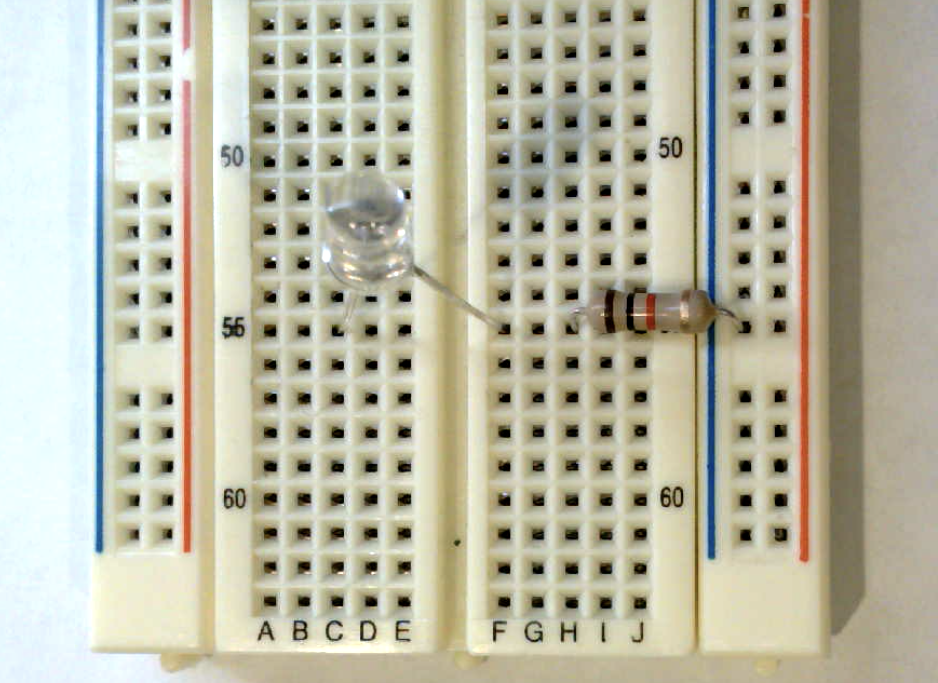
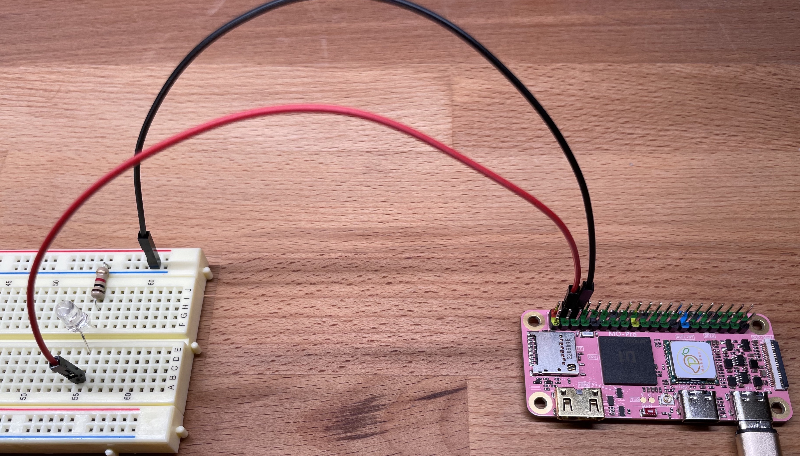
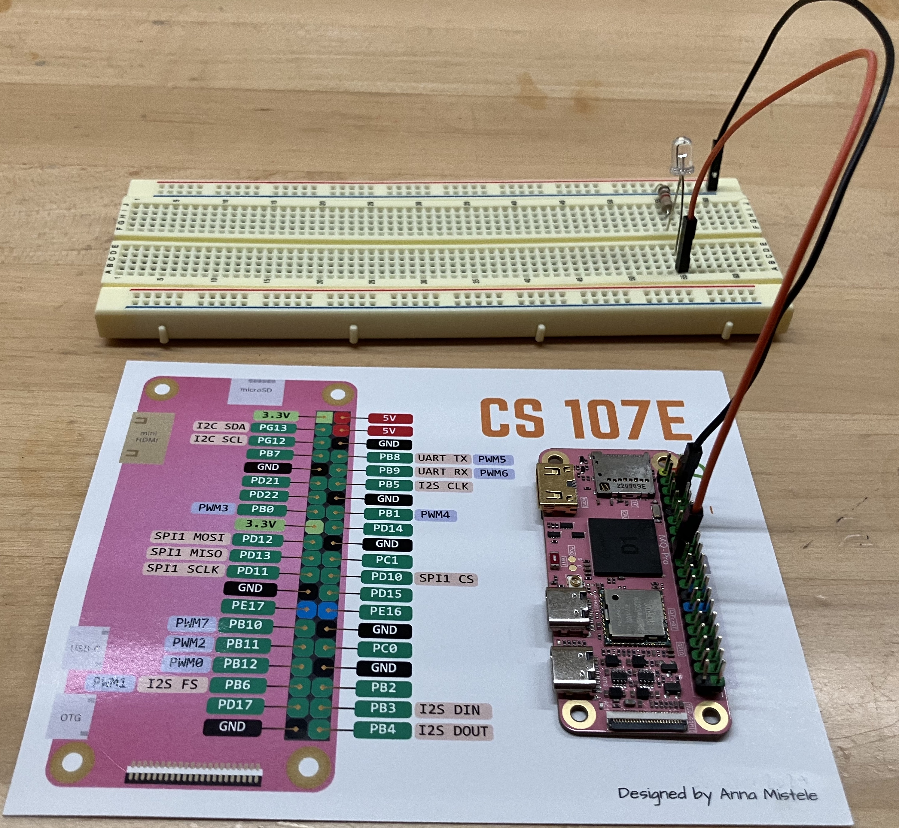


Task list to copy/paste when creating PR for this lab:

__Before releasing lab1:__
- [ ] Review writeup/code/checkin questions (instructor)
- [ ] Walk through (SL)
- [ ] Followup on issues from previous quarter postmortem (issue #)

__To prep for lab1:__
- [ ] Review tips recorded in private/staff_notes.md and private/answers.md
- [ ] Confirm multimeters have fresh batteries
- [ ] Build kits
- [ ] Bring blank labels and pens -- students make name tag and decorate kit box



## Goals

During this lab you will:

- Explore simple breadboard circuits using LEDs, resistors, and buttons.
- Practice with building and running programs on the Pi.
    - Build programs using the cross-development tools you installed on your computer
    - Download and run programs on the Pi using the `xfel` bootloader
- Explore the assembly code for the blink and button programs.

## Prelab preparation

To prepare, please do the following before coming to lab:

1. Organize supplies to bring with you:
    - Bring your __laptop__, ideally with full charge, cable/charger as needed.
    - If you have access to a __multimeter__, bring it along.
1. Reading to do ahead of lab:
    - Read this SparkFun tutorial on [using a breadboard](https://learn.sparkfun.com/tutorials/how-to-use-a-breadboard). Pay special attention to the section labeled "Anatomy of a Breadboard" to learn about the internal connections.
    - Please review our course guides on:
        -  [powering the Pi](/guides/power)
        -  [using the xfel bootloader](/guides/xfel) to send programs to the Pi
        -  [one page of RISC-V](/guides/riscv-onepage) assembly
1. When you arrive at lab, check that your Stanford ID card is registered with the card reader. When you wave your ID at the reader, it should blink green and unlock the door. If the reader doesn't accept your card, add your name/SUID number to our post on Ed and we will follow up to correct it.

## Lab exercises

### 0. Pull lab starter code

Before starting a new lab or assignment, cd to your local `mycode` repo and pull in the lab starter code:

```console
$ cd ~/cs107e_home/mycode
$ git checkout dev
$ git pull code-mirror lab1-starter
```

Your repo should be on the `dev` branch and there is a new subfolder named `lab1` containing the lab starter files.

### 1. Inventory your kit

You will receive your parts kit when you arrive at lab. Open it up and check it out!
Unwrap and discard any packaging. Identify what each component is and compare to the [kit inventory](/guides/bom/) to ensure your kit is complete. If you are missing any parts, ask us for replacements.

The components are packed in a handy plastic box for convenient carrying. Write your name on the white label on the box top to help you and and your box stay united. Plan to bring your entire parts kit to every lab.

### 2. Power up your Pi and use `xfel` to converse
Start with our course guides to acquaint with your new BFF.

- Read through the guide on [powering the Pi](/guides/power) and:
    - follow the instructions to connect your Pi to power
- Open the guide to the [xfel bootloader](/guides/xfel) and follow along with steps to:
    - peek and poke to control the blue act led
    - use `xfel` commands to bootload a program
    - use `mango-run` as a convenience for bootloading
- If you run into any snags or have questions, be sure to ask for help!

Change to the directory cs107e/bin directory and use the following commands to examine the size and data in the `blink-actled.bin` program file:
```console
$ cd $CS107E/bin
$ ls -l blink-actled.bin
$ hexdump -C blink-actled.bin
```
How many bytes of data are in the program file? How many instructions does this correspond to? What does this data represent?

Reset your Pi. Use `xfel` to initialize the memory controller and hexdump contents of 200 bytes of memory at address `0x40000000`.

```console
$ xfel ddr d1
$ xfel hexdump 0x40000000 200
```
Review the contents of the xfel hexdump. Does the newly initialized memory seem to filled with zeros, random values, or some pattern?

 Use `xfel` to write the `blink-actled.bin` program to that memory location and then hexdump the memory again.

```console
$ xfel write 0x40000000 blink-actled.bin
$ xfel hexdump 0x40000000 200
```
Review the xfel hexdump. How have the contents of the memory on the Pi now changed?

Use `xfel` to execute the loaded program.
```console
$ xfel exec 0x40000000
```
You should be rewarded with a blinking blue act led on the Mango Pi board.

### 3. Breadboard LED circuit

You'll be using the breadboard from your kit to wire up simple circuits. It is important to understand how the breadboard is internally constructed. Which holes are connected to which other holes?  How are the power and ground rails connected? Review the section  "Anatomy of a Breadboard" in the SparkFun [tutorial on breadboard](https://learn.sparkfun.com/tutorials/how-to-use-a-breadboard#anatomy-of-a-breadboard) from the pre-lab.

Get our your multimeter (if you have one), or grab a multimeter from the lab cabinet if your table doesn't have one. You are going to use the multimeter to test the internal connections. Pick up two __male-male__ jumpers (any colors) from the bin in lab. Choose two holes along one of the power rails and plug one end of each jumper into the holes. Confirm these holes are connected by applying the multimeter leads to the free ends of the jumpers and testing for continuity. Now move the jumpers around to different positions on the breadboard (for example, two holes within same row or same column or one hole in each power or ground rail) as you continue testing for continuity. Confirm that you understand which holes are connected and which are not.

You are going to wire up a simple circuit to light an
LED. You'll need a LED and a 1K resistor from your kit. A resistor's value is indicated by the sequence of colored bands. (See this Sparkfun [tutorial on resistors](https://learn.sparkfun.com/tutorials/resistors#decoding-resistor-markings) for help on decoding the bands and bookmark this [color code calculator](http://www.digikey.com/en/resources/conversion-calculators/conversion-calculator-resistor-color-code-4-band).) What are the band colors for 1K?  Find a 1K resistor in your kit and use the multimeter to measure the resistance to confirm the value.

Make a circuit on your breadboard for the LED. Remember that the LED has a directionality -- the longer lead is the anode and the shorter lead is the cathode.  The voltage from anode to the cathode
should be positive.  If the polarity of voltages are switched, the LED
will not light up.  The LED also needs a current-limiting resistor
otherwise it can literally [blow up in a fiery, smoky
extravaganza](https://www.youtube.com/watch?v=WLctUO1DGtw)! There is no directionality to the leads of the resistor.

In the photo below, the cathode of the LED connects to one end of the resistor and the other end of the resistor connects to the
the blue ground rail.  The LED crosses over the middle of the breadboard.  (click photo to enlarge)

{: .zoom}

We are just playing with this circuit in lab, so we won't worry about making things tidy and secure. When installing a more permanent circuit such as for assignment 1, you can use pliers to make a clean bend in the legs and snip the ends with a cutter so that each component sits neatly on the breadboard.

To light the LED, you need to apply power to the anode
and complete the circuit by connecting the cathode to ground. The power and ground will come from the header pins on your Mango Pi.

Follow these steps:

1. First, disconnect or switch off your Pi.
    >**Danger** Always take care to cut power to the Pi
    before you fiddle with the wiring.
    If you leave it plugged in, power is flowing and all wires are live, which makes for a dicey situation. An accidental crossed wire can a short circuit, which could fry your Pi or make your
    laptop disable the USB port.
    {: .callout-danger-invert}

1. Pick out two __female-male__ jumpers from your kit, one red and one black. You'll use the red for power and black for ground. Electrons don't care about colors, but adopting good conventions will helps us humans more easily trace and debug our circuits.

1. Orient your Pi so that the 40-pin header is in a vertical column on the right edge to match the [pinout diagram](/guides/refcard/).  Use the pinout/color to identify a 5V power pin and a GND pin on the header of the Mango Pi. Connect the female ends to the Mango Pi:  black jumper to ground and red to power.

    You'll refer to the pinout a lot, keep the refcard in your kit. We also have a command-line version for that retro ascii art feel. Try the command out now!
    ```console
    $ pinout.py
    ```

1. Plug the male ends of the jumpers into the breadboard: the black jumper to the blue ground rail and the red jumper to the anode of the LED. (click photo to enlarge)

    {: .zoom}

1. After double-checking that your circuit wiring is correct, you're
ready to apply power. Power up the Pi and the LED on the breadboard should light.


While the LED is lit, make the following measurements with the multimeter.

-   Measure and record the voltage across the resistor
-   Measure and record the voltage across the LED

Apply Ohm's law to these measurements to calculate the current flowing through the LED.

If you substitute a 10K resistor in place of the 1K, how will this change the rate of current flow?   How does it change if you connect to a 3.3V power pin on the Pi instead of 5V?

What effect do these changes have on the brightness of the LED? Do some comparisons with tablemate. Have one of you swap and compare the brightness of the changed circuit to the original and see the effect with your own eyes.  (Be sure to disconnect power before fiddling with the wiring!)

### 4. Blink breadboard LED
You want to run `blink` program from lecture which blinks a led connected to gpio `PB0`. Re-configure your breadboard circuit by connecting `PB0` to the anode of the LED. Use the pinout to identify which header pin is `PB0`. Be sure to have the power off while you are rewiring.

{: .zoom}

The `blink` subfolder of `lab1` contains the code for the blink program shown in lecture. Change to that folder and build the `blink` program using these commands:
<a name="build"></a>
```console
$ cd lab1/blink
$ riscv64-unknown-elf-as blink.s -o blink.o
$ riscv64-unknown-elf-objcopy blink.o -O binary blink.bin
```
The `riscv64-unknown-elf-as` command assembles the RISC-V instructions in `blink.s` into an "object
file". The assembler takes in assembly instructions (text) and translates to machine-encoded instructions (binary). In addition to the encoded instructions, the object file includes some additional information in it that we don't need -- we just want the
program.  The command `riscv64-unknown-elf-objcopy` extracts just the raw binary program of instructions into a file
`blink.bin`.

Use the `mango-run` command to send the program to the bootloader:

```console
$ mango-run blink.bin
xfel ddr d1
Initial ddr controller succeeded
xfel write 0x40000000 blink.bin
100% [================================================] 36.000 B, 21.542 KB/s
xfel exec 0x40000000
```

Running the `blink.bin` program on the Pi should pulse gpio `PB0` which is connected to the LED on your breadboard.

If you change your program and want to run it again, you must first 
reset the Pi. What happens if you try to `mango-run` a second time
after the bootloader has already loaded a program? Why does that happen?

You can reset the Pi by briefly cutting power either by unplugging and replugging or flipping the cable switch on and off.
The Pi will restart into the bootloader, ready to receive a new program.

### 5. Study the blink program

Below is the blink program that from lecture. This code is available in the file `lab1/blink/blink.s` and also reproduced below.

```
    lui     a0,0x2000       # a0 holds base addr PB group = 0x2000000
    addi    a1,zero,1       # a1 holds constant 1
    sw      a1,0x30(a0)     # config PB0 as output

loop:
    xori    a1,a1,1         # xor ^ 1 invert a1
    sw      a1,0x40(a0)     # set data value of PB0 to a1

    lui     a2,0x3f00       # a2 = init countdown value
delay:
    addi    a2,a2,-1        # decrement a2
    bne     a2,zero,delay   # keep counting down until a2 is zero

    j       loop            # back to top of outer loop
```

If there is anything you don't understand about this program,
ask questions of your partner and others.

Edit the initial countdown value to make the delay to be half as long. Rebuild and run the program to see that it now blinks twice as fast. Modifying the program is a multi-step process. First you edit `blink.s` in a text editor, then repeat the two [build commands](#build) (assemble and objcopy) to rebuild `blink.bin` . To run the new program, first reset your Pi by unplugging and replugging, then use `mango-run blink.bin` to run your updated program on the Pi. Make sure you understand why these steps are all necessary.

_Pro-tip:_ Your shell keeps a history of your previous commands and makes it easy to repeat a previous command without retyping it. If you don't yet know how to access or search that history, ask a tablemate to show you!

Reset your Pi now and re-run the blink program. Hooray! 👏

> Grab a TA for help if you run into snags or have questions about steps to edit/compile/execute.
> We want everyone to leave lab with a working process as this is an important takeaway for getting going on Assign1.
{: .callout-warning}

Experiment with changing the countdown value to achieve a blink rate of roughly 1 second on and 1 second off. Using that value you can calculate an estimate how many instructions per second the Mango Pi is executing.  Be sure to take into account that the `lui` instruction stores to the upper 20 bits of the register (effectively left-shifting immediate value by 12).

What is your experimental estimate of the number of instructions per second executed by the Mango Pi? How did you compute it? Compare your estimate to your neighbors. How does this match to the stated clock speed of the Mango Pi?

<A name="button"></A>
### 6.  Add a button
The final lab exercise is to study the `button` program and build a breadboard circuit to test the program.

This button program is in the file `lab1/button/button.s` and is repeated below. It reads the state of a button connected to gpio `PC0` and turns off the LED on gpio `PB0` when the button is pressed.

```    
    lui     a0,0x2000       # a0 holds gpio base addr = 0x2000000
    addi    a1,zero,0x1     # a1 holds constant 1
    sw      a1,0x30(a0)     # config PB0 as output
    sw      a1,0x40(a0)     # turn on PB0
    sw      zero,0x60(a0)   # config PC0 as input

loop:
    lw      a2,0x70(a0)
    and     a2,a2,a1
    beq     a2,zero,off
on:
    sw      a1,0x40(a0)
    j       loop

off:
    sw      zero,0x40(a0)
    j       loop
```

Challenge yourself to understand
what each line of code accomplishes and why it works as expected. We annotated the first few lines to get you started, add your own annotations as you figure out each line. Have the [D1 user manual](/readings/d1-h_user_manual_v1.0.pdf) handy for looking up information about the GPIO peripheral and bookmark our one-page guide to [RISC-V instructions](/guides/riscv-onepage).

Here are a few questions to test your understanding.

-  What information is stored in the peripheral register at address `0x02000070`?
-  What is the relationship between the `CFG0` and `CFG1` registers?
-  What value is being tested by the `beq` instruction?

Now that you understand how the program operates, you are ready to configure a breadboard circuit to test the program.

Grab a pushbutton mechanism, a button cap, and a 10K resistor from your parts kit. The button has four legs. The legs are partitioned into two pairs of legs, where the pair is always connected. When the button is pressed, all four legs become connected. Your first task is to work out which leg pairs are always connected and which only become connected when the switch is closed. How the legs are wired is not obvious! A good way to experimentally confirm is to measure continuity across the legs using a multimeter.  Once you understand how the legs are connected,  position the button on the breadboard so it can act as a switch.

An important detail to work out is the default value of the input pin that reads the button state. Before we connect a pin to something, its voltage is in a "floating" state. We need to intentionally pull the pin to a known initial state to ensure we get a reliable reading. The button program is written to expect that the button state is initially high and goes low when pressed.  We will connect the pin to the power rail via a 10K resistor and "pull up" the line to set its initial state as high. This will cause the connected gpio to read as high. When the button is pressed, it grounds the circuit and it will read low.  Sparkfun has a nice tutorial on the [use of pull-up resistors](https://learn.sparkfun.com/tutorials/pull-up-resistors/all) for more information.

Here is the schematic. VCC is 3.3V and R1 is 10K.


{: .w-50 .mx-auto}

Make the above circuit on your breadboard and connect gpio PC0 as your input pin to read the button state. Use your pinout to find PC0 on the Pi header. Be sure to include the 10K resistor! Without that resistor, pressing the button would create a short between power and ground and could damage your Pi.

After confirming your circuit is correctly constructed, you are ready to power it up and build and run the button program.  Time for another round of `risv64-unknown-elf-... uh`, what was that again? Let us offer another useful tool to add to your bag of tricks: `make`. The file called `Makefile` lists the commands to build and run the program and allows you to skip entering them out again and again.  Next week's lab will have an exercise on exploring `make`, for now, you can take it on faith that the command `make run` is shortcut for building and running a program on the Mango Pi. Try it out now!

```console
$ make run
riscv64-unknown-elf-as button.s -o button.o
riscv64-unknown-elf-objcopy button.o -O binary button.bin
mango-run button.bin
```

If you have wired up your circuit correctly, the LED should be on at start and whenever the button is held down, the LED turns off.

Show us your annotated version of `button.s` and talk us through your understanding. Considering changing the setup to use `PB1` instead of `PC0` as the input pin to read the button state. What would need to change on the breadboard? How would the code need to change?

## Finishing

### Check in as you go
- Lab is all about supportive group learning. Use this time to ollaborate with your peers and check in with a TA as you work.
- Use the questions embedded into the exercises as an opportunity for reflection and self-test. Discuss your answers with your neighbors to confirm you have the correct understanding. Bring in a TA for additional consultation or help with unresolved issues.
- Remember the goal of the lab is not to rush through to finish fastest -- it's to work through the material and build understanding.

### Submit exit form
- Each of you should fill out our [lab exit form](https://forms.gle/LuiTo5vhaHUQjhcF8) to let us how the lab went for you and note any issues for us to followup with you.
- It's okay if you don't fully complete all exercises during
lab; your sincere participation for the full lab period is sufficient
for credit.  However, if you don't finish, we highly encourage you to
work those parts to solidify your knowledge of this material before
moving on.

### Clean up
- Before leaving lab, be sure to return our tools and supplies to their rightful place, discard any trash from your table, and straighten up the tables and chairs. Our lab room is our home, let's all work together to keep it a tidy and welcoming place!

