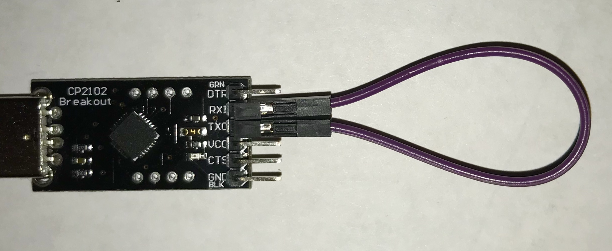

<script>
$().ready(function() {
    var elems = document.getElementsByClassName('language-terminal');
    for (const elem of elems) elem.className += ' terminal-gdb';
});
</script>

Task list to copy/paste when creating PR for this lab:

__Before releasing lab3:__
- [ ] Review writeup/code/checkin questions (instructor)
- [ ] Walk through (SL)
- [ ] Followup on issues from previous quarter postmortem ()

__To prep for lab3:__
- [ ] Be extra careful when reviewing gdb exercise, make sure nothing has changed to invalidate the typescript embedded in writeup
- [ ] Make copies of gdb one-page ref to hand out in lab



## Goals

During this lab you will:

- Learn how to use `riscv-unknown-elf-gdb` in simulation mode.
Simulation mode is also a good way to learn more about how the RISC-V processor executes instructions.
- Use gdb to trace through function call/return and examine registers and memory.
- Learn how to use `tio` with the USB-serial adapter. Also understand how the UART peripheral works.
- Implement a few simple C-string operations and use a combination of
unit testing and gdb simulation to debug your work.

These exercises are useful preparation for your next assignment which is to implement `printf` for your Pi.

## Prelab preparation

To prepare for lab, do the following:

1. Read our [guide to using gdb in simulation mode](/guides/gdb). Print out a copy of [gdb one-page guide](/guides/gdb-onepage.pdf) to have on hand.

## Lab exercises

### 0. Pull lab starter code

Change to your local `mycode` repo and pull in the lab starter code:

```console
$ cd ~/cs107e_home/mycode
$ git checkout dev
$ git pull code-mirror lab3-starter
```

### 1. Serial communication

#### 1a) Connect usb-serial
Find the usb-serial breakout in your parts kit and follow the instructions in the [uart guide](/guides/uart) to make a serial connection between your laptop and the Mango Pi.

#### 1b) Loopback test

Grab your USB-serial adapter and a female-female jumper to do a loopback test. Directly connect TX to RX on the USB-serial adapter in loop back mode, as shown in this photo:

{: .zoom}

In loop back mode, the signals sent out on the TX pin are wired straight to the RX pin. Reading from the RX pin will read the characters sent over TX.

Insert the USB-serial adapter into a USB port on your laptop. Use our [find-dev.sh](/guides/install/cp2102#find-dev) script to get the device path.  Open a `tio` conection to your device path.

```console
$ tio /dev/YOUR_DEVICE_PATH
```

Type some characters in the tio window. They should be echoed by tio. Try manually sending a line feed `LF` by typing `control-j` and a carriage return `CR` by typing `control-m`. What is the difference in behavior of `LF` versus `CR`? When you hit the enter/return key on your keyboard, does it seem to send a `LF`, a `CR`, or both?

Keep on typing while your neighbor reaches over and gently disconnects one end of the loopback jumper. Where are the characters going now?

Reconnect the jumper and type some more.  Your characters are echoed again.

You might think typing a character on the keyboard comes with an entitlement to seeing it drawn on the screen, but in fact, the tio program and the CP2102 are essential components of that communication. Tio observes the typed character, sends it out over the serial TX line, and is listening on the serial RX line and echoing what it receives. In loop back mode, tio happens to only be talking to itself, but it doesn't know this. If you disconnect the loopback jumper, characters are no longer echoed because they were never received.

When you connect the TX and RX to the Mango Pi, tio is bridging the communication between your laptop and the Pi. Tio sends what you type to the Pi and displays what is received from the Pi. Neat!

(Fun aside for the curious: scoot your computer next to a buddy and use jumpers to connect the TX of your CP2102 to the RX of their CP2102 and vice versa. Now what happens when you type in your tio windows?)

You can exit tio by typing `control-t q`. However, you probably won't often quit and restart tio. Instead, open a separate terminal window for tio and keep tio running at all times. In your other terminal window(s), you will be issuing commands, editing, building, etc. while the tio window maintains an open communication channel with the Pi. When you power-cycle or reset your Pi, the tio window will report a temporary disconnect, but will reestablish communicated with the device when reconnected.

#### 1c) UART/printf test

Re-connect the TX/RX jumpers between the USB-serial and the Pi. Remember the RX of the USB-serial connects to the TX of the Pi, and vice versa (the connections are __not__ TX-TX and RX-RX). Have `tio` running and connected.

Initialize the dram on the Mango Pi by entering the following command in your terminal (not your tio window), and see what is printed in your tio window!

```console
$ xfel ddr d1
```
Interesting! When FEL is running, it has been sending diagnostic log messages on the serial line all along. Now that we have a channel open, we can hear what it's saying.

Change to the directory `lab3/uart-printf`.

```console
$ cd lab3/uart-printf
$ ls
Makefile  hello.c
```
Review the code in `hello.c`. This program uses the `uart_putstring` function
to send characters from the Pi's TX pin.


```console
$ make run
mango-run hello.bin
xfel ddr d1
Initial ddr controller succeeded
xfel write 0x40000000 hello.bin
100% [================================================] 132.055 KB, 341.767 KB/s
xfel exec 0x40000000
```
Over in your tio window, you should see this output:

```
hello, laptop
hello, laptop
hello, laptop
hello, laptop
hello, laptop
We <3 printf!
```

The function `uart_putstring` outputs a string constant, but what is much more useful is the ability to output formatted strings, e.g. `printf`. For example, the call `printf("Today is %s %d\n", monthname, daynum)`
inserts the month string and day number into the output. To learn more about how to use printf, check out the standard library [printf documentation](http://www.tutorialspoint.com/c_standard_library/c_function_printf.htm).

In Assignment 3, you will implement your own version of `printf`.  With a working `printf`, your programs will be able to report on their state and super-charge your debugging. What a big improvement over trying to communicate everything using only LEDs!

Open `hello.c` in your text editor and edit the `main` function to try out `printf`:

1. Add a `printf` statement inside the loop body to output the value of `i` on each loop iteration.

1. After the loop, add a `printf` statement to output the value of `*pb_config0` in hex format with field width 8.

1. Add code to configure GPIO_PB3 and GPIO_PB7 as output using `gpio_set_output` and printf `*pb_config0` again.

1. Add code to reconfigure GPIO_PB3 and GPIO_PB7 as input using `gpio_set_input` and printf `*pb_config0` again.


Use `make run` and view the program's output. The print statements you added allow you to observe that `gpio_set_function` is correctly doing its job-- neat!

### 2. Debugging with gdb

#### 2a) Use `gdb` in simulation mode

This exercise is to practice using the `gdb` debugger and the RISC-V simulator.
A debugger allows you to observe and manipulate a running program and its program state.
Running a debugger on the actual bare-metal hardware is challenging, so we instead will use
 `gdb` on our local computer, running on program on RISC-V emulation layer built-in to gdb.

`gdb` is an wondrously powerful tool. Proficiency with `gdb` can improve a programmer's debugging efficiency by a factor of 10; in the hands of an expert, maybe a factor of 100. It gives you extensive
visibility into a program: when you know where to look, you can use the debugger to dig into
the ground truth of what is happening and how your code has gone astray.  Mastering the debugger is just
as important as mastering your editor and compiler.

In this exercise, you'll walk through the basic features of `gdb` on an example program.
Change to the directory `lab3/simple` directory and review the code in `simple.c`.

Use the target `make debug` to build the `simple.elf` program and start it under
gdb. (Note that gdb reads the ELF file, not the raw binary file that we have been running on the actual Pi.)


```console?prompt=$
$ make debug
riscv64-unknown-elf-gdb -q --command=$CS107E/other/gdbsim.commands simple.elf
Reading symbols from simple.elf...
```

Each time you start gdb, you need to use the same commands to enter the simulator, so we made a general command file `gdbsim.commands` that is auto-loaded as part of our `make debug` target. The auto-loaded commands show gdb connecting to the simulator and loading the program:

```console?prompt=(gdb)
Auto-loading commands from $CS107E/other/gdbsim.commands...
Connected to the simulator.
Loading section .text, size 0x154 lma 40000000
Loading section .eh_frame, size 0x2c lma 40000158
Start address 40000000
Transfer rate: 3072 bits in <1 sec.
Function "timer_get_ticks" not defined.
Breakpoint 1 (timer_get_ticks) pending.
```

The `start` command will begin executing the program and stop at the `main` function.

```console?prompt=(gdb)
(gdb) start
Temporary breakpoint 2 at 0x40000108: file simple.c, line 30.
Starting program: /Users/julie/github/mango-staff/labs/lab3/code/simple/simple.elf

Temporary breakpoint 2, main () at simple.c:30
30  int main(void) {
(gdb)
```

Here the program is stopped at the beginning of the main function. The `next` command executes
the next line of C source.
The command `print d` shows the value of `d`
after the call completes. 

```console?prompt=(gdb)
Temporary breakpoint 2, main () at simple.c:30
30 int main(void) {
(gdb) next
33     int d = diff(x, y);
(gdb) next
34     int f = factorial(7);
(gdb) print d
$1 = 74
(gdb) print f
$2 = <optimized out>
(gdb) next
35      int n = make_array();
(gdb) print f
$3 = 5040
```

Note that when `gdb` shows your program stopped at a line, 
it's stopped  _before_ that line has executed. At the end of the sequence shown above, the program is stopped before calling 
`factorial`. When we try to print `f`, it is not accessible because we have not yet executed the line where it is declared/initialized.
If we `next` over that line and then print `f`, we see its value.

Sometimes you want to step __into__ the code of the function being called.
To do this, use `step` instead of `next`. Put another
way, `next` executes the entire next line in the function
you're in, while `step` executes the next line of code, 
which may be in a different function.

Use `start` to restart the program and again stop at `main()`.
and then use `step` from there.

```console?prompt=(gdb)
(gdb) start
Temporary breakpoint 2 at 0x40000108: file simple.c, line 30.
Starting program: .../lab3/simple/simple.elf

Temporary breakpoint 2, main () at simple.c:30
30 int main(void) {
(gdb) step
33     int d = diff(x, y);
(gdb) ⏎
diff (a=a@entry=33, b=b@entry=107) at simple.c:27
27     return abs(b - a);
(gdb) ⏎
abs (v=v@entry=74) at simple.c:6
6      int result = v < 0 ? -v : v;
```

The return/enter key(`⏎`) causes `gdb` to repeat the last command (in above sequence, it will `step` two more times).

We first stepped into `diff` then took two steps in `abs` and execution is now stopped at the return statement.

When stepping through code, gdb displays the next line of code to be executed. To see more context, use the `list` command
```console?prompt=(gdb)
(gdb) list
2   * Sample code to use as gdb practice.
3   */
4
5  int abs(int v) {
6      int result = v < 0 ? -v : v;
7      return result;
8  }
9
10 int factorial(int n) {
11     if (n <= 1)
```

Use `continue` to resume executing the program. While the program is executing, type `control-c` to interrupt the running program and return to the `(gdb)` prompt. Use the `backtrace` command to see where the program was executing when it was interrupted:

```console?prompt=(gdb)
(gdb) continue
Continuing.
^C
Program received signal SIGINT, Interrupt.
0x0000000040000008 in hang ()
(gdb) backtrace
#0  0x0000000040000008 in hang ()
```

The above information tells you that the program is stopped in `hang`. Review the code in `start.s` to see what happens before and after the `main()` function. If currently at `hang`, we know that `main()` has run to completion and is in infinite loop we use as a "holding pattern".

When debugging a function, a common workflow is to

  1. `break` on the function in question. `run` until you hit the breakpoint.
  1. Use `next` to step through each line of its code, using `print`, `info locals`, `info regs`, etc to  examine state of variables and registers.
  1. If the next line of code is a call to a subroutine and you suspect the problem could be inside that call, use `step` to drop down into it.  If you `next` through a call and realize that you wish you had used `step` instead, use `run` to start over from the beginning and get another chance.
  1. Recursively apply rules 2-3 until you find the bug.

#### 2c) Use `gdb` to access stack frames
There are gdb commands that allow you to trace function calls and view stack frames.  Let's try them out!

Set a breakpoint on the `abs` function:
```console?prompt=(gdb)
(gdb) break abs
Breakpoint 4 at 0x40000044: file simple.c, line 6.
(gdb) run
Starting program: /Users/julie/github/mango-staff/labs/lab3/code/simple/simple.elf

Breakpoint 4, abs (v=v@entry=74) at simple.c:6
6       int result = v < 0 ? -v : v;
```

You are now stopped at the breakpoint on `abs`. The command `disassemble` with no arguments lists the assembly instructions in the context where the program is currently executing. The instruction marked `=>`is the next one to be executed.
    
```console?prompt=(gdb)
(gdb) disassemble
Dump of assembler code for function abs:
=> 0x0000000040000044 <+0>:     sraw    a5,a0,0x1f
   0x0000000040000048 <+4>:     xor a0,a0,a5
   0x000000004000004c <+8>:     subw    a0,a0,a5
   0x0000000040000050 <+12>:    ret
End of assembler dump.
```
Note that the first instruction of `abs` is at
address `0x40000044`, as we expected.
We asked for a breakpoint on the function `abs` and gdb converted our request to `0x40000044` which corresponds to the address of the first instruction of `abs`. A breakpoint set at `0xAddr` will stop the program just before executing the
instruction at `0xAddr`. 

Use the gdb `backtrace` to show the sequence of function
calls leading to here:

```console?prompt=(gdb)
(gdb) backtrace
#0  abs (v=v@entry=74) at simple.c:6
#1  0x00000000400000fc in diff (a=a@entry=33, b=b@entry=107) at simple.c:27
#2  0x0000000040000124 in main () at simple.c:33
#3  0x0000000040000008 in _start_gdb ()
```

The backtrace shows that the function `abs` has been called by `diff`
from line 27, which in turn was called by `main` from line 33.  The
numbers on the left refer to the *frame*.  The innermost frame is
numbered 0, and corresponds to the currently executing function, in this case, `abs`. Frames for caller functions have higher numbers. The `info frame` command prints a summary of the current stack frame:

```console?prompt=(gdb)
(gdb) info frame
Stack level 0, frame at 0x4fffffd0:
 pc = 0x40000044 in abs (simple.c:6); saved pc = 0x400000fc
 called by frame at 0x4fffffe0
 source language c.
 Arglist at 0x4fffffd0, args: v=v@entry=74
 Locals at 0x4fffffd0, Previous frame's sp is 0x4fffffd0
```

The `info locals` and `info args` commands give more information about the stack frame's arguments and local variables:

```console?prompt=(gdb)
(gdb) info args
v = 74
(gdb) info locals
result = <optimized out>
```

`gdb` lets you choose which frame on the call stack you wish to inspect.
The command `up` selects the frame that is one step up the call stack (e.g. frame of caller) and `down` moves back to callee.

```console?prompt=(gdb)
(gdb) up
#1  0x00000000400000fc in diff (a=a@entry=33, b=b@entry=107) at simple.c:27
27     return abs(b - a);
(gdb) info args
a = 33
b = 107
(gdb) info locals
No locals.
(gdb) down
#0  abs (v=v@entry=74) at simple.c:6
6      int result = v < 0 ? -v : v;
(gdb) info args
v = 74
```

Another useful `info` command is `info reg` which displays the values currently in the Pi's registers. 
```console?prompt=(gdb)
(gdb) info reg
ra             0x400000fc   0x400000fc <diff+16>
sp             0x4fffffd0   0x4fffffd0
gp             0x0  0x0
tp             0x0  0x0
t0             0x0  0
t1             0x0  0
t2             0x0  0
fp             0x4a 0x4a
s1             0x13b0   5040
a0             0x4a 74
a1             0x6b 107
a2             0x0  0
a3             0xb  11
a4             0x4  4
a5             0x0  0
a6             0x0  0
a7             0x0  0
s2             0x0  0
s3             0x0  0
s4             0x0  0
s5             0x0  0
s6             0x0  0
s7             0x0  0
s8             0x0  0
s9             0x0  0
s10            0x0  0
s11            0x0  0
t3             0x0  0
t4             0x0  0
t5             0x0  0
t6             0x0  0
pc             0x400000fc   0x400000fc <diff+16>
```
What value is currently in `a0`? Why does `a0` contain that value? (Consider: at what point in the program execution are we stopped right now? What was the last use of `a0`?) What value is in `a1`?

You can access a single register by using the syntax $regname, e.g. `$a0`.

```console?prompt=(gdb)
(gdb) print $a0
$4 = 74
```
For further practice with gdb and stack frames, now try tracing and exploring with the `factorial` and `make_array` functions.

The `factorial` function operates recursively. Set a breakpoint on `factorial` so gdb will stop on each recursive call.  Use `continue` to continue the program. Each new call to `factorial` will stop the program at the breakpoint you set.  At the breakpoint, use `backtrace` each time to see how the stack changes as you get deeper into the recursion. Try moving `up` and
`down` and use `info frame` and `info args` to view individual stack
frames.  Note how each invocation has its own distinct copy of the parameter `n`.

The function `make_array` demonstrates how the stack is used
for storage of local variables. A local variable of size 64 bits or fewer (i.e. int/long) is likely stored in a register without the overhead of  writing to stack memory. Larger data
structures, such as arrays and structs, that do not fit in a register must be stored on the
stack. Set a breakpoint on the `make_array` function. Use `info locals` to see the array contents at the start of the function. Are
the array elements initialized to any particular value?  Step through
the loop a few times and use `info locals` to see how the array is
updated. 

The goal of all this mucking about in gdb is to solidify your understanding the mechanics of function calls and the runtime stack. If there are portions you don't yet understand, ask your tablemates or the staff to resolve those questions now.

Now introduced to `gdb`, you'll want to incorporate it into your development process and to practice until you become comfortable and fluent.  Gdb can help you learn more about how your C code translates to generated assembly, and being able to observe and manipulate your program while it is executing will be an invaluable aid when tracking down bugs.

In software development, only a small fraction of your time goes into writing the code, the rest is taken up in testing and debugging. These are important skills to hone and adept use of `gdb` can streamline your efforts by a significant factor. Developing your debugging superpowers will pay off many times over!


### 3. C-strings

For this exercise, you will work with C-string functions and get further practice with unit-testing and debugging.
Change to the `lab3/cstrings` directory and open the `cstrings.c`
file in your editor.

The first string operation to look at is `strlen`. This function returns the count of characters in a C-string. How is it possible to determine where a C-string ends? Is the null terminator included in the count? 

Review the given (correct) code for `strlen` in `cstrings.c`.  It uses array subscripting on a variable declared as a pointer. Why is this legal?  What does it mean to access the nth array element of a pointer variable?

The code for `strlen` is simple enough that you might feel confident calling it correct "by inspection", but let's use our unit testing strategy to truly confirm the behavior of the executing function.

Read through the test cases in the `test_strlen`.
Compile the program and run it on the Pi (with `make run`, not `make test` in this case). Your test program should successfully run to completion. It is a correctly-implemented `strlen` function, as advertised.

Now, let's move on the `strcpy` operation. This function copies the characters from one string to another:

```c
char *strcpy(char *dst, const char *src);
```

Pampered programmers who work on hosted systems receive `strcpy` as part
of the standard library, but we must implement it ourselves for the Pi.

Functions in the standard library each have a man page that documents the function's use and behavior. Bring up the man page for `strcpy`.

```console
$ man strcpy
```

Read the man page and then try implementing `strcpy` yourself. Does `strcpy` copy only the non-null characters or is the terminator included?  If you're not sure, read the man page to confirm the expected behavior.

When you are ready to test your `strcpy`, review the test cases in the `test_strcpy` function. Uncomment the call to `test_strcpy` in `main()`. Use `make run` to rebuild the program and run it on the Pi.

If you get the blue flash of doom, dig in to find out what's gone wrong
and work to resolve the issue. Don't move on until all
tests pass and you earn the peace and quiet from your Pi.

### 4. Gdb and testing

You can also test a program by running within gdb in simulation mode. Let's try that now on the cstrings program from the previous exercise.

#### Debug strlen

Edit `strlen` to intentionally plant a bug, such as changing the function to always return `7`. This will cause test failures in `test_strlen`. Use `make run` to build the program and run on the Pi and you get the flashing LED that indicates a failed assert.

Let's learn how that failed assert is presented under the debugger. Use `make debug` to get the buggy program under gdb and run it. There is no flashing light; the simulator is not talking to your Pi nor its peripherals. Your Pi doesn't even need to be connected!

What do you see in gdb? There is output announcing the failed assertion and then the program exits.

```console?prompt=(gdb)
(gdb) run
Starting program: /Users/julie/github/mango-staff/labs/lab3/code/cstrings/cstrings.elf
File cstrings.c, line 26, in function test_strlen() : Assertion 'strlen("green") == 5' failed.
[Inferior 1 (process 42000) exited with code 01]
```

Look we learn that the failed assertion occurred on line 26 of the `cstrings.c` file (your code may be on a nearby line number, depending on how long your `strcpy` implementation was). Use `list` to see that code now:

```console?prompt=(gdb)
(gdb) list cstrings.c:26
22
23  void test_strlen(void) {
24      char *fruit = "watermelon";
25
26      assert(strlen("green") == 5);
27      assert(strlen("") ==  0);
28      assert(strlen(fruit) == 2 + strlen(fruit + 2));
```

This allows us to pinpoint exactly which assert failed (rather than have to comment-in-and-out tests one by one to find it). Hooray for gdb!

Restore `strlen` to its correct implementation, rebuild and run again under the debugger. All tests should pass, no report of failed assertion, and gdb reports that the program "exited normally".

```console?prompt=(gdb)
(gdb) run
Starting program: /Users/julie/github/mango-staff/labs/lab3/code/cstrings/cstrings.elf
[Inferior 1 (process 42000) exited normally]
(gdb)
```


> __Tip__ If your program appears to be unresponsive or you just want to stop the progrma and poke around, type `control-c` to interrupt the executing program and return control to gdb. Use `backtrace` to see where the program was executing when it was interrupted.
{: .callout-info}

Learn to recognize these two common situations: 
+ a successful run to completion that exits normally
+ a failure that halts the program at the point of the failed assertions

#### Debug bogus_strlen_calls

Both `strlen` and `strcpy` have been shown to work correctly for valid calls. We are now going to do a little exploration into what happens 
for calls that misuse the functions.

Review the code in the aptly-named `bogus_XXX` functions.
Get together with your tablemates and look at the three "bogus" calls.
For each consider __why__ it is invalid: what is improper about the C-string that is being passed as the argument?

The string functions in the standard C library are generally not robust against bad calls, especially those that ask a function to read or write invalid memory.  The reason for this is not for performance or
due to laziness -- it's actually not possible for `strlen` to verify that its argument is a valid C-string. A `char*` is
not necessarily a pointer to a string -- it could be just a pointer
to a single character. Furthermore the address might not have a char pointee  at all -- it could be an int stored there or the address might be completely invalid or contents uninitialized. The C language does not have a reliable means to determine the validity of a pointer and reject the bad ones.

Uncomment the call to one of the bonus functions in `main()`. Rebuild the program and run it under gdb. Single step through the call and print the value returned by the bad call. Is the result what you anticipated?  What did you learn from this about the
observed consequences of reading uninitialized or invalid memory?

__Test your understanding__. On a hosted system, executing an incorrect call to `strlen` (e.g. argument is an invalid address or unterminated string) can result in a runtime error (crash/halt). But when running bare metal on the Pi, every call to `strlen` (whether well-formed or not) will complete "successfully" and return a value. Explain the difference in behavior. What will be the return value for an erroneous call?

#### The dangers of C-strings

The fact that a C-string depends on a properly-placed NULL terminator to mark the end puts the responsibility squarely on the programmer's shoulders. If you forget to write the terminator or forgot to account for that extra byte when allocating space, nothing will stop you or give a helpful error message. Instead, the assembly code will simply walk off the string end and access the neighboring memory. For example, consider this code:

```c
struct request {
  char* filename;
  char* host;
};

void process_request(struct request* request) {
  char filename[128];
  strcpy(filename, request->filename);
  read_file(filename); 
}
```

This code might seem contrived, but it's similar to what a lot of web server code
looked like in the early 2000s. Recall from lecture that variables allocated inside
functions are put on the stack: `filename` is an array of 128 bytes on the stack. 

Talk with your neighbor: what happens if `request->filename` is longer than 128 characters?
What will the call to `strcpy` do?
How might this cause software to fail or act unpredictably? If this code existed in a critical context, could it cause a serious failure? It's useful to note that that
[the git codebase (source code for the git program itself) bans the use of `strcpy`](https://github.com/git/git/blob/master/banned.h). Instead, you always are supposed to use `strncpy`, which has an explicit maximum
length for copying. E.g., this code would be OK:

```c
struct request {
  char *filename;
  char *host;
};

void process_request(struct request *request) {
  char filename[128];
  // 127 to make sure there's space for a \0
  stnrcpy(filename, request->filename, 127);
  read_file(filename); 
}
```

#### Differences under simulation
It is important to be aware of the discrepancies you may observe when comparing the behavior of a program running on the Pi versus running under the gdb simulator. Read the section titled [Differences due to simulation](/guides/gdb/#differences-due-to-simulation) in our gdb guide to be introduced to some of the issues you may run into.

Change to the directory `lab3/simulator` directory and review the program in the `buggy.c` file  Trace through the operation of the program. What do you predict will be printed as output?

Build the program using `make`.

Use `make run` to run the program on the Pi. Does the output printed by the program match what you predicted earlier?  Use `make run` to run the program again. Is the output printed the same as the previous run?

Now load the same program into gdb simulator using `make debug`. If you run this program on the simulator, the program does not have the same output that you observed when running on the Pi. Why is it different?

Without exiting gdb, use `run` to run the program for a second time. How does this output compare to the previous run? Re-run the program a few more times in gdb until you understand the pattern. What have you learned about how the simulator handles the state of memory between runs? How does this compare to what happens to the state of memory when you reset the actual Pi and re-run the program?

The gdb simulator is a powerful addition to your toolbox, but it is important to understand its limitations and differences from an actual Pi. Running a program under the gdb simulator is not be a perfect match to running on the actual Pi. A particularly frustrating situation can come from a program that exhibits a bug running on the Pi, but appears to run correctly under the simulator or work on a first run in gdb but not a subsequent. What underlying difference(s) between the simulator and real thing might contribute to this kind of inconsistency?


## Finishing

### Check in as you go
Please touch base with us during lab to ask your questions and confirm your understanding. We are here to help!

### Submit exit form
Before leaving, submit the [lab exit form](https://forms.gle/9m4WvAaFD57GQZs17) to let us how the lab went for you and note any issues needing followup. The key goals for this lab are to ensure a working uart/tio and a basic understanding of gdb and eagerness to learn more.


