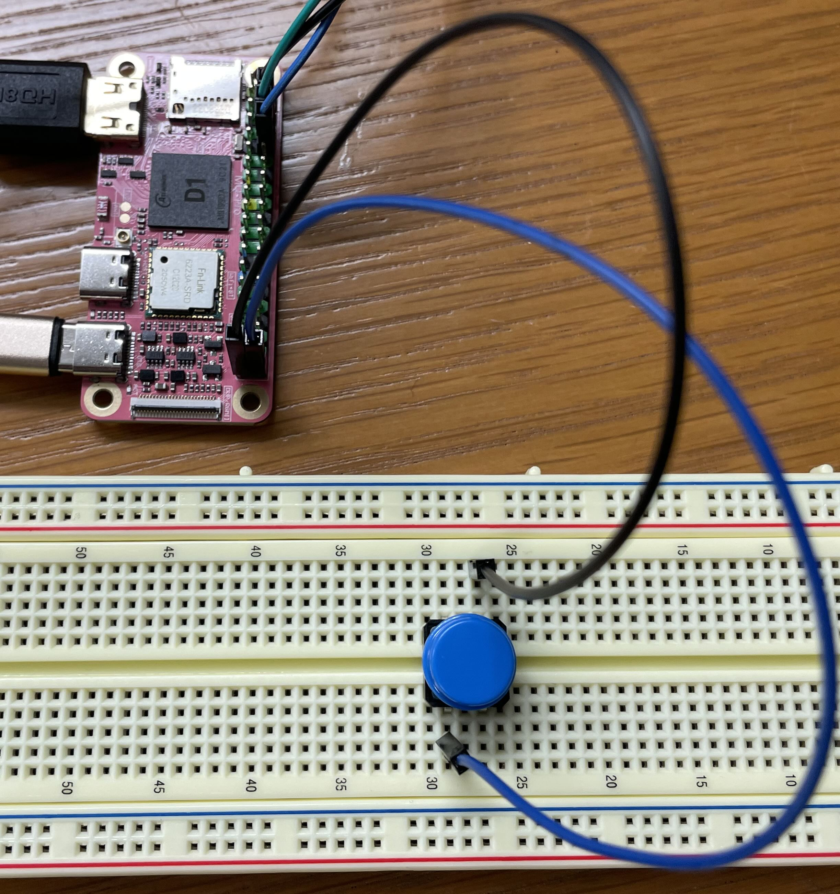


Task list to copy/paste when creating PR for this lab:

__Before releasing lab7:__
- [ ] Review writeup/code/checkin questions (instructor)
- [ ] Walk through (SL)
- [ ] Followup on issues from previous quarter postmortem (issue #)

__To prep for lab7:__
- [ ] Ensure monitor/cable per pair avail in lab



## Goals

The goal of this lab is to get you started with interrupts in preparation for
your final assignment.

During this lab you will:

- Review the support code for interrupts on the Pi,
- Write code to handle button presses using GPIO event interrupts, and
- Brainstorm possibilities for achieving world domination with your final project.

## Prelab preparation
To prepare for lab, do the following:

- Review the interrupt support code we introduced in lecture (all source files in directory `$CS107E/src`);
    - `interrupts_asm.s` assembly instructions for interrupt vectors, enable/disable
    - `interrupts.c` library module that configure/manages interrupt sources and trap_handler dispatch to registered handler per-source
    - `gpio_interrupt.c` library module used to configure/manage GPIO interrupts and dispatch to registered handler per-pin
    - `ringbuffer.c` library module that implements queue as ringbuffer, safe for shared access by one enqueuer + one dequeuer
    - `hstimer.c` library module for countdown timer

- Browse our [project gallery](/project_gallery/) to gather ideas and inspiration from the projects of our past students.

## Lab exercises

### Pull lab starter code

Change to your local `mycode` repo and pull in the lab starter code:

```console
$ cd ~/cs107e_home/mycode
$ git checkout dev
$ git pull code-mirror lab7-starter
```
### Interrupts

#### 1) Review interrupt assembly

In the first lecture on interrupts, we went over the low-level mechanisms. The `interrupts` module is used to configure interrupts and manage handlers at a global level. The module interface is documented in [interrupts.h](/header#interrupts) and its implementation is split into the files [interrupts.c](/src#interrupts) (C code) and [interrupts_asm.s](/src#interrupts_asm) (assembly). These source files are available in the directory `$CS107E/src`.

Start by reviewing the `interrupts_asm.s` file which contains the assembly portion of the `interrupts` module implementation.  Here is a roadmap to the functions:

- `interrupts_global_disable` and `interrupts_global_enable`
    - set/clear machine-mode interrupt bits in the `mstatus` and `mie` CSRs.
- `interrupts_get_mepc` and others
    - retrieve CSR values that are needed by the interrupts module
-  `interrupts_set_mtvec`
    - sets the address of the function to execute on a trap

There is not much to the assembly code; it is needed simply because the CSRs can only be accessed by the special `csr` assembly instructions.

The function that will be installed as the trap handler using `interrupts_set_mtvec` should be declared `__attribute__((interrupt("machine")))`. Review the [gcc documentation](https://gcc.gnu.org/onlinedocs/gcc/RISC-V-Function-Attributes.html) to learn about function attributes. The generated assembly will include a prolog/epilog to safely enter and exit interrupt processing.

Open <https://gcc.godbolt.org/z/rM8h8erdE> in your browser; this is a Compiler Explorer example that shows a normal function and three handler functions marked with the interrupt attribute. Compare the normal function to the handler function to see what is different about the generated assembly.

+ What assembly instruction is used to return from a handler function? At what address will it resume execution? From where is that address obtained?

+ The three handler functions differ in which registers are saved to the stack on entry and restored on exit. The function handlerA spills no register, handlerB spills `a4` and `a5`, handlerC spills half of all of the 32 general-purpose registers. Why the difference in which registers are being saved? Why those specific registers are not others?

+ How does the memory being used for the stack frame for the handler function relate to the stack memory being used by the regular execution?


#### 2) Review interrupt dispatch

The C code in `interrupts.c` implements the bulk of the `interrupts` module.  Start by reviewing the implementation of the `trap_handler` function. This function is installed using `interrupts_set_mtvec` and will be called for every trap. If the trap was due to an external interrupt, it dispatches to the registered handler. All other trap causes are an unrecoverable fatal exception, so the functions prints an error message and exits with `mango_abort`.

In our second lecture on interrupts, we reviewed the design that dispatches an event to its associated handler. The design for dispatch in both `interrupts` and `gpio_interrupt` uses an array of function pointers, one per-index. The client who wants to use interrupts must implements a handler function and registers it with the dispatcher. The dispatcher stores the client's function pointer in the array at the associated index. When an event occurs, the dispatch invokes the handler at that index. In the top-level `interrupts` module, the interrupt source number is the index into the array of handlers. In the `gpio_interrupt` module, the pin index within the gpio group is used as the index.

There is a neat performance trick that applies here. To identify which event is pending, the dispatcher scans the pending/status registers to find the first bit that is set. If you were implementing that scan in C, you might loop and shift/test each bit indvidually. A more streamlined version could do fancy bit twiddling, such as Kernighan's algorithm, or employ on a lookup table. Such versions might take tens or even hundreds of cycles.

A better way to implement is to drop down to assembly and leverage bitwise tricks to count leading zeros. We are using the hand-rolled assembly provided by gcc in software (`__builtin_clz`). Enthusiastic hackers compete to see if they can [outperform it](https://www.reddit.com/r/RISCV/comments/132s19s/hand_optimised_riscv_assembly_language_clz/).  The recently ratified RISC-V [Zbb extension](https://drive.google.com/file/d/11-dKxnp7yfl9L3HESXGCtYl90dFKGTzE/view) adds a `clz` (count leading zeros) instruction that counts in as few as 3 cycles. (The C906 processor in the Mango Pi predates this extension).  Reducing the time it takes to find a pending interrupt from 100 to 3 cycles, (an improvement of 33x!) is a big benefit to every single interrupt.  This kind of throughput boost is why instructions like `clz` exist. Neat!

Test your understanding of interrupt dispatch by answering these questions -- check in with us to confirm your answers!

+ How is a function "registered" as a handler with a dispatcher? How does the dispatcher know which handler to call for a given event? Can there be multiple handlers registered for the same event? If there is no handler registered for a pending event, what will the dispatcher do with the event?

+ An `aux_data` pointer can be stored with the handler. That pointer is later passed as an argument to the handler when invoked. What is the purpose of an `aux_data` pointer?


#### 3) Set up a button circuit

Now let's execute some code that uses interrupts. Set up a one-button circuit on your breadboard. Connect one side of the button to gpio PB4 and the other side to ground. Connect your Pi to a HDMI monitor.

{: .zoom -w-50}

Back in Assignment 2, we put a hardware resistor in the button circuit to set default state. This time, the code activates the internal pull-up instead. When the button is not pressed, the internal resistor "pulls up" the value to 1.  When the button is pressed, it closes the circuit and connects the pin to ground. The value then reads as 0.

Review the code in `lab7/button/button.c`. In the starting version, `main` function sits in a loop that waits for a click and then redraws the screen.

Fill in the implementation of the empty `wait_for_click` function to operate by _polling_. It should:

1. Wait for a falling edge on the button gpio, i.e. poll `gpio_read` until observe a transition from 1 to 0.

2. When observe falling edge, increment the `gCount` global variable and announce with a `uart_putstring("click!")`

Compile and run the program. The program sits ands waits for you to click the button. When you do, the message is printed and the screen redraws to show the incremented count. This version of the program is always redrawing or waiting for a click, but it's either one or the other. While waiting for a button press, the screen redraw is paused. While redrawing the screen, no button presses are detected. Ideally, we want the program to do both tasks concurrently.

- If you click the button multiple times in quick succession, some of
the presses are missed. You get neither a printed message nor a screen
redraw and these clicks are not included in the count. Why does that happen?

You'll note that redrawing the screen is quite slow. If we were to speed up the drawing, it would cause us to miss fewer events, but it doesn't fundamentally solve the problem. Interrupts are the better solution!

#### 4) Write a button handler

Remove the call to `wait_for_click` from the loop in `main`. Compile and re-run. The program now repeatedly redraws the screen.  If you click the button, there is no response. The program never calls `wait_for_click` and won't observe any change in the GPIO pin, it's 100% occupied with drawing.

You are now going to rework the program to process those button clicks as interrupts.

Start by reviewing the documentation for the library modules you will use:
+ [gpio_interrupt.h](/header#gpio_interrupt)
    * Gpio interrupts module
+ [interrupts.h](/header#interrupts)
    * Top-level interrupts module

There are multiple steps to set up an interrupt and coordination is across two modules: `gpio_interrupt` for gpio-sepcific configuration and top-level `interrupts` module for global state.

- Edit function `config_button` to setup button for gpio interrupts
    + Init `gpio_interrupt` module
    + Configure button gpio interrupt on negative edge event
    + Implement a handler function to process event
        + Handler must match prototype `void handle_click(void *aux_data)`
        + Use the `aux_data` parameter to pass a message to your handler. The handler treats the received pointer as `char *` and calls `uart_putstring` to output the message.
        + Be sure that your handler clears the event!
    + Register your handler as gpio interrupt for button gpio
        + For `aux_data`, pass the message string "[PUT-YOUR-NAME-HERE] has interrupt mojo" so the handler will print this message.
    + Enable gpio interrupt on button gpio
- Edit function `main` to init/enable interrupts at top-level
    + Init `interrupts` module (at start of program)
    + Enable global interrupts (final step, after all pieces configured and ready)

The order that you do these operations is important: think
carefully about each action, revisiting the lecture slides/code if
you need to.  Talk this over with your tablemates and ensure that you
understand what each step does and why it's necessary.

Compile and run the program. If you have done everything correctly, the program continuously redraws as before, but now whenever you click the button, it prints a message in your terminal to congratulate your prowess with interrupts and the click count increments. You get the best of both worlds: your long-running computation can be written as a simple loop, yet the system is immediately responsive to input.

Once you have it working, go back and intentionally make various errors, such as doing steps out of order, forgetting a step, or doing a step twice.  Seeing the observed consequences of these mistakes now may help you to identify them in the future.

Some things to try:
- What happens if you try to register a handler before initializing the module?
- What happens if you try to init the interrupts module more than once?
- What happens if the interrupt handler does not clear the event?

#### 5) Coordinate between main and interrupt

You want to change the program to now redraw once in response to a button click rather than continuously update. This requires that the interrupt and main code share state.

Edit the code within the loop in `main` to only call `redraw` if the count of clicks `gCount` has changed since the last redraw. Save the count used at last redraw in the local variable `drawn` and compare to `gCount` to determine when a redraw is necessary.

The count is being stored in the global variable `gCount`. The handler increments it and the `main` reads the value and compares to saved count.  `gCount` is not currently declared `volatile`. Should it be? Why or why not?  Can the compiler tell, by looking at only this file, how control flows between main and the interrupt handler? Will the compiler generate different code if `volatile` than without it? Will the program behave differently? Test it both ways to confirm what (if any) is the consequence of not declaring the `gCount` variable as `volatile`.

#### 6) Use a ring buffer queue

Watch carefully as the program executes and you'll note that every click is detected and counted, but the count of redraw iterations is not one-to-one with those updates. Multiple clicks can occur before the `main` loop gets around to next checking the value of `gCount`.

To track all updates and process each one by one, we can use a queue to communicate between the interrupt handler and `main`. The handler will use a queue to enqueue each update and `main` will dequeue each update. Because the queue stores every individual update posted by the interrupt handler, we can be sure that we never miss one.

How to rework the code:

- Review the [ringbuffer.h](/header#ringbuffer) header file and source file [ringbuffer.c](/src#ringbuffer) to see the provided ring buffer queue. This ADT maintains a queue of integer values implemented as a ring buffer.
- In the `main` function, declare a variable of type `rb_t *rb` and initialize with a call to `rb_new`.  Use the `rb` pointer as the `aux_data` pointer when registering the handler.
- Edit your handler to now cast the `aux_data` parameter to type `rb_t *`.  In the handler, enqueue the updated value of count to the ring buffer by calling `rb_enqueue`.
- Edit `main` to use `rb_dequeue` to retrieve each update from the queue. This replaces the previous code that compared `gCount` to the saved value to detect a change in click count. Be careful with the second argument to `rb_dequeue` -- you are passing the address of an int and `rb_dequeue` will write the dequeued value to that memory location (i.e. used as "out" parameter).

Make the above changes and rebuild and run the program. It should now redraw the screen once for each button press in one-to-one correspondence, including patiently processing a backlog of redraws from a sequences of fast presses.

When you're done, take a moment to verify your understanding:

- Why is the significance of the return value from `rb_dequeue`? Why is it essential to pay attention to that return value?
- With this change, is it now necessary for `gCount` to be declared `volatile`? Does the ring buffer need to be declared `volatile`?  Why or why not?
- Why might you want the handler to enqueue an update and return instead of doing the actual task (e.g. redraw) directly in the handler?


### Project brainstorm and team speed-dating

Visit our [project gallery](/project_gallery/) to see a sampling of projects
from our past students. We are __so so proud__ of the creations of our past
students -- impressive, inventive, and fun! You'll get started in earnest on
the project next week, but we set aside a little time in this week's lab for a
group discussion to preview the general guidelines and spark your creativity
about possible directions you could take in your project. If you have questions
about the project arrangements or are curious about any of our past projects,
please ask us for more info, we love to talk about the neat work we've seen our
students do. If you have ideas already fomenting, share with the group to find
synergy and connect with possible teammates. Project teams are most typically
pairs, although occasionally we have allowed solo or trios by special request.


### Bonus speed exercise
In past quarters, we have used some of the time in lab7 for explorations in performance optimization. We don't think there will be time for it today, but we linked the [performance materials](speed) if you want to check it out for fun.


## Finishing

### Check in as you go
Please touch base with us during lab to ask your questions and confirm your understanding. We are here to help,
let us know of any challenges or confusions we can help resolve with you!

### Submit exit form
Before leaving, submit the [lab exit form](https://forms.gle/iowzdU3uy7Q3WiDW6) to let us how the lab went for you and note any issues needing followup. The key goals for this lab are to leave with working code for client use of interrupts and feel ready for starting on Assignment 7.


